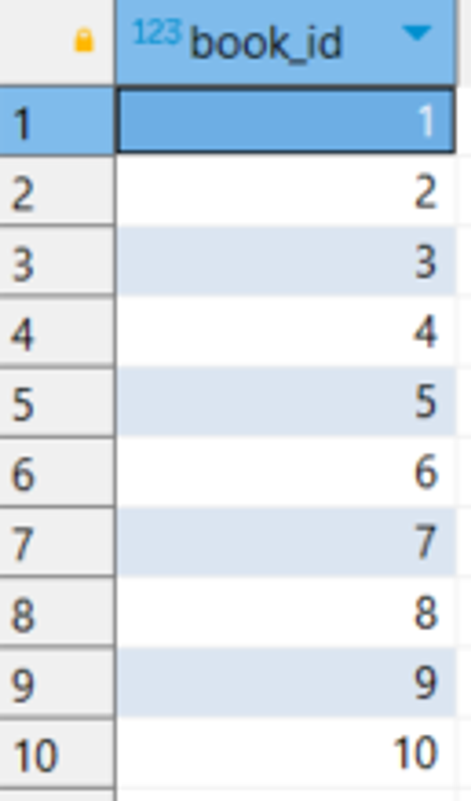
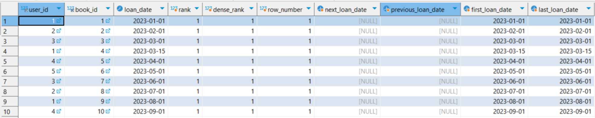

📌 개인적인 공간으로 공부를 기록하고 복습하기 위해 사용하는 블로그입니다. <br>
정확하지 않은 정보가 있을 수 있으니 참고바랍니다 :😸 <br>
[틀린 내용은 댓글로 남겨주시면 복받으실거에요]  
{: .notice--primary}


# TCL(Transaction Control Language)

## Transaction

트랜잭션✨✨✨✨✨✨✨- 백앤드에서 중요

스프링할 때 @transactional 붙여주면 알아서 다 해주지만  알아야한다.

속성은 면접에서 많이 물어봄  - 면접단골질문

1. **Transaction 개념 및 속성 - ACID**
   
    1. 하나 이상의 데이터베이스 연산이 묶여서 하나의 논리적인 작업 단위로 처리되는 것을 말함. 
    2. 트랜잭션은 일련의 연산 중 하나라도 실패하면 전체 연산이 취소되는 원자성(Atomicity) 가짐.
    3. 데이터베이스에서 트랜잭션은 다음과 같은 4가지 특성을 가지고 있다.
    4.  **ACID**는 데이터베이스에서 트랜잭션의 원자성, 일관성, 격리성, 지속성을 보장하기 위한 기본적인 트랜잭션 처리 원칙을 나타내는 약어
    5. ACID ⇒ 관계형 데이터베이스의 특징 , noSQL은 관련 없음
    
       
    
       
    
    
    
    
    
    - **원자성(Atomicity)**: 트랜잭션은 일련의 연산 중 하나라도 실패하면 전체 연산이 취소됨
    
    - **일관성(Consistency)**: 트랜잭션이 완료되면 데이터베이스의 일관성이 유지
    
    - **격리성(Isolation)**: 여러 개의 트랜잭션이 동시에 수행될 때 각각의 트랜잭션이 서로에게 영향을 미치지 않음
    
    - **지속성(Durability)**: 트랜잭션이 완료되면 그 결과가 영구적으로 반영
    
      

### ACID 실무 사례

1. 은행 애플리케이션
   
    
    
    1. **원자성(Atomicity)**: 계좌 이체 작업은 출금 연산과 입금 연산으로 이루어지는데 출금 연산이 성공하고 입금 연산이 실패하면, 계좌 간 이체 작업이 완전하지 않으므로 이전 상태로 롤백되어야 한다. 이를 위해 애플리케이션에서는 출금 연산과 입금 연산을 하나의 트랜잭션으로 묶어서 처리하고, `하나의 연산이 실패하면 전체 작업이 롤백` 된다.
    
    2. **일관성(Consistency)**: 계좌 이체 작업은 출금 연산과 입금 연산이 일어나기 때문에 데이터베이스의 일관성이 유지되어야 한다. 이를 위해 애플리케이션에서는 `트랜잭션 실행 전에 데이터베이스를 락(lock)하여 다른 사용자가 데이터를 수정하지 못하도록 한다.`
    
    3. **격리성(Isolation)**: 동시에 여러 개의 계좌 이체 작업이 발생할 수 있으므로, 트랜잭션 간 상호 간섭을 방지해야 gksek. 이를 위해 애플리케이션에서는 트랜잭션 간 **격리 수준(Isolation level)을 설정하여 다른 트랜잭션의 영향을 받지 않도록** 해야한다.
        <br/>

    4. **지속성(Durability)**: 계좌 이체 작업이 완료되면 데이터베이스에 반영되어야 한다. 이를 위해 애플리케이션에서는 `트랜잭션이 완료되었을 때, 데이터베이스에 변경 내용을 저장하고, 장애가 발생해도 이전 상태로 롤백되지 않도록 복구와 백업 작업을 수행`한다.
    
    따라서, ACID를 보장하는 은행 애플리케이션에서 계좌 이체 작업은 트랜잭션으로 묶여 처리되고 <br/>
    이를 통해 데이터의 일관성과 무결성을 보장하고, 데이터베이스 시스템에서 트랜잭션 처리를 안정적으로 보장할 수 있다.
    
    

## TCL(Transaction Control Language)

트랜잭션의 처리를 위한 명령어들의 집합

1. **COMMIT :** 
    1. 현재까지 수행한 트랜잭션의 결과를 데이터베이스에 저장
    2. COMMIT 명령어를 실행하면 트랜잭션이 종료되고, 데이터베이스의 일관성이 유지됨
2. **ROLLBACK :**  
    1. 현재까지 수행한 트랜잭션의 결과를 취소하고, 트랜잭션을 초기 상태로 되돌림.
    2.  ROLLBACK 명령어를 실행하면 트랜잭션이 종료되고, 데이터베이스의 일관성이 유지됨
    
3. 예제, 아래 코드에서는 트랜잭션을 시작하고, `COMMIT`으로 트랜잭션을 종료한다.
    **`ROLLBACK`을** 사용하여 해당 트랜잭션 이전까지의 작업을 취소 
    
    
    ```sql
    -- 트랜잭션 시작
    START TRANSACTION;
    
    -- 테이블에 데이터를 삽입
    INSERT INTO Users (user_id, username, email)
    VALUES (301, 'John', 'john.doe@example.com');
    
    -- 테이블에서 데이터를 갱신
    UPDATE Users SET email = 'john.doe@example.org' WHERE user_id = 301;
    
    -- 테이블에서 데이터를 삭제
    DELETE FROM Users WHERE user_id = 301;
    
    -- 트랜잭션 이전 상태로 롤백
    ROLLBACK;
    
    -- 트랜잭션 종료
    COMMIT;
    
    ```
    
    즉 COMMIT에 도달하지 못하고  ROLLBACK 되어 트랜잭션 이전의 상태로 돌아간 후 종료됨.
    
    

# 집합연산자

MySQL 데이터베이스에서 집합연산자는 여러 SELECT 문의 결과를 하나의 결과 집합으로 결합하는 데 사용

MySQL은 다음 세 가지 집합연산자를 제공합니다.

1. UNION
2. UNION ALL
3. INTERSECT (MySQL 8.0.31 이상에서 지원)
<br/>
<br/>
<br/>

| 연산자 | 의 미 | 결과 |
| --- | --- | --- |
| UNION | 합집합 | 중복을 제거한 결과의 합을 검색 |
| UNION ALL | 합집합 | 중복을 포함한 결과의 합을 검색 |
| INTERSECT | 교집합 | 양쪽 모두에서 포함된 행을 검색 |
| MINUS | 차집합 | 첫 번째 검색 결과에서 두 번째 검색 결과를 제외한 나머지를 검색 |


- JOIN과 비슷함, JOIN보다 성능이 좋고 하는 역할이 다르다

- UNION ALL이 성능이 더 좋음, 합치기만 하면 되기 때문

- JOIN은 컬럼을 합쳐서 열을 늘린다면, UNIONALL은 행을 늘림

  


### **1. UNION**

**`UNION`** 연산자는 두 개 이상의 SELECT 문의 결과를 결합하여 하나의 결과 집합으로 만듭니다. 

중복된 행은 제거되고 결과 집합은 정렬됩니다.

```sql
SELECT username, email
FROM Users
UNION
SELECT name, address
FROM Publishers;
```

>실행결과


<Br/>

### **2. UNION ALL**

**`UNION ALL`** 연산자는 두 개 이상의 SELECT 문의 결과를 결합하여 하나의 결과 집합으로 만든다. 중복된 행도 모두 포함한다.

```sql
SELECT username, email
FROM Users
UNION ALL
SELECT name, address
FROM Publishers;
```

>실행결과


<Br/>


### **3. INTERSECT**

**`INTERSECT`** 연산자는 두 개 이상의 SELECT 문의 결과 집합에서 공통된 행만 반환합니다. 결과 집합은 정렬됩니다. (MySQL 8.0.31 이상에서 사용 가능)

```sql
SELECT book_id FROM LoanRecords
INTERSECT
SELECT book_id FROM Books;
```

>실행결과




<Br/>

# 그룹함수

### **1. ROLLUP**

- 계층적 집계를 수행하는 함수
- 여러 열을 기준으로 그룹화하고 부분 합계 및 총계를 계산
- 왼쪽에서 오른쪽으로 열을 그룹화하며 상위 레벨의 집계를 생성
- 예제
  
    ```sql
    -- LoanRecords, Books, Publishers 테이블을 조인하여 출판사 ID와 책 ID별로 대출 횟수 집계
    SELECT 
        p.publisher_id,  -- 출판사 ID
        lr.book_id,      -- 책 ID
        COUNT(*) AS total_loans  -- 대출 건수 카운트
    FROM 
        LoanRecords lr
    JOIN 
        Books b ON lr.book_id = b.book_id  -- LoanRecords와 Books를 책 ID로 조인
    JOIN 
        Publishers p ON b.publisher_id = p.publisher_id  -- Books와 Publishers를 출판사 ID로 조인
    GROUP BY 
        p.publisher_id,  -- 출판사 ID로 그룹화
        lr.book_id       -- 책 ID로 그룹화
    WITH ROLLUP;        -- ROLLUP을 사용하여 각 출판사와 책의 조합, 출판사 전체, 그리고 전체 대출 건수 계산
    
    ```
    
    **WITH ROLLUP 사용X**
    
    
    
    **WITH ROLLUP 사용O**
    
    
    
    
    
    
    
    **데이터 변경 후 ROLLUP 적용**
    
    
    
    
<Br/>
    

### **2. GROUPING 함수**

예제 

```sql
SELECT p.publisher_id,
    lr.book_id, COUNT(*) as total_loans
FROM LoanRecords lr
JOIN 
    Books b ON lr.book_id = b.book_id 
JOIN 
    Publishers p ON b.publisher_id = p.publisher_id 
GROUP BY publisher_id, book_id;
```


<Br/>

GROUPING 및 ROLLUP사용시

```sql
SELECT p.publisher_id,  -- 출판사 ID
    lr.book_id, COUNT(*) as total_loans, 
**GROUPING**(p.publisher_id) as is_publisher_total, 
**GROUPING**(lr.book_id) as is_book_total
FROM LoanRecords lr
JOIN 
    Books b ON lr.book_id = b.book_id  -- LoanRecords와 Books를 책 ID로 조인
JOIN 
    Publishers p ON b.publisher_id = p.publisher_id 
GROUP BY publisher_id, book_id **WITH ROLLUP**;
```

>코드 실행시


<Br/>

publisher_id, book_id별 대출 횟수 합계, publisher_id별 대출 횟수 합계, 그리고 전체 대출 횟수 합계를 반환

**`is_publisher_total`** 및 **`is_book_total`** 열을 사용하여 해당 행이 publisher_id 또는 book_id에 대한 합계인지 여부를 확인할 수 있음

# 윈도우함수

DB별로 많이 달라서 외울 필요 없음, 추가로 붙이기 위해 많이 사용

1-3까지는 RANK함수, 순위매기는 함수

1. **RANK() - 일반적인 경우, 공동 1등이 있을 경우 다음 등수는 3등**
2. **DENSE_RANK()  - 동시에 겹치는 것을 허락하지 않음.**
3. **ROW_NUMBER() - 1등이 100명이여도 다음 등수는 2등임**
4. **LEAD()**
5. **LAG()**
6. **FIRST_VALUE()**
7. **LAST_VALUE()**
8. 집계 함수(**SUM()**, **AVG()**, **MIN()**, **MAX()** 등)

- 예제

```sql
SELECT user_id, book_id, loan_date,
       RANK() OVER (PARTITION BY book_id ORDER BY loan_date DESC) as 'rank',
       DENSE_RANK() OVER (PARTITION BY book_id ORDER BY loan_date DESC) as 'dense_rank',
       ROW_NUMBER() OVER (PARTITION BY book_id ORDER BY loan_date DESC) as 'row_number',
       LEAD(loan_date) OVER (PARTITION BY book_id ORDER BY loan_date) as next_loan_date,
       LAG(loan_date) OVER (PARTITION BY book_id ORDER BY loan_date) as previous_loan_date,
       FIRST_VALUE(loan_date) OVER (PARTITION BY book_id ORDER BY loan_date DESC) as first_loan_date,
       LAST_VALUE(loan_date) OVER (PARTITION BY book_id ORDER BY loan_date DESC ROWS 
       BETWEEN UNBOUNDED PRECEDING AND UNBOUNDED FOLLOWING) as last_loan_date
FROM LoanRecords;
```

1. **PARTITION BY**: 결과 집합을 지정된 열(여기서는 book_id)을 기준으로 여러 그룹으로 나누고 이를 통해 윈도우 함수는 각 그룹 내에서만 작동하게 되어 그룹별로 분석 작업을 수행할 수 있다

2. **ROWS**: 현재 행과 관련된 행 수를 기준으로 윈도우 프레임의 범위를 설정

3. **RANGE**: 현재 행과 관련된 값 범위를 기준으로 윈도우 프레임의 범위를 설정

4. **PRECEDING** 및 **FOLLOWING**: 윈도우 프레임 범위를 설정할 때 사용되는 키워드로, 현재 행보다 이전 또는 다음에 있는 행을 포함하도록 범위를 지정한다.

5. >실행결과
   
    
    
    <Br/>

    결과 해석 : 이 쿼리는 **`LoanRecords`** 테이블에서 대출 기록을 분석
    
    1. **`RANK() OVER`**: 각 책의 대출 날짜를 기준으로 등수를 매김
    
    2. **`DENSE_RANK() OVER`**: 각 책의 대출 날짜를 기준으로 밀집된 등수를 매김
    
    3. **`ROW_NUMBER() OVER`**: 각 책의 대출 날짜를 기준으로 행 번호를 매김
    
    4. **`LEAD() OVER`**: 다음 대출 날짜를 가져온다
    
    5. **`LAG() OVER`**: 이전 대출 날짜를 가져온다.
    
    6. **`FIRST_VALUE() OVER`**: 각 책의 대출 날짜를 기준으로 첫 번째 대출 날짜를 가져온다.
    
    7. **`LAST_VALUE() OVER`**: 각 책의 대출 날짜를 기준으로 마지막 대출 날짜를 가져온다.
    
<Br/>
loan_date table


<Br/>


# DCL (Data Control Language, 데이터 제어어)

DCL은 데이터베이스 내의 접근 권한을 관리하는 SQL 명령어들을 포함

이 명령어들을 사용하여 데이터베이스 객체에 대한 사용자의 접근을 허용하거나 제한할 수 있습니다, 이로써 데이터의 보안과 무결성을 유지할 수 있음

### **주요 DCL 명령어**

1. **`GRANT`** : 사용자에게 데이터베이스 객체에 대한 권한을 부여합니다. 사용자는 부여된 권한을 통해 데이터베이스 객체를 조회, 수정, 삭제할 수 있음
   
    ```sql
    **GRANT** SELECT, UPDATE, DELETE ON Books TO 'username';
    ```
    
     위 코드에서는 사용자 'username'에게 'Books' 테이블에 대한 조회(SELECT), 수정(UPDATE), 삭제(DELETE) 권한을 부여
    
2. **`REVOKE`** : 사용자로부터 데이터베이스 객체에 대한 권한을 제거
   
    ```sql
    **REVOKE** SELECT, UPDATE, DELETE ON Books FROM 'username';
    ```
    
     위 코드에서는 사용자 'username'로부터 'Books' 테이블에 대한 조회(SELECT), 수정(UPDATE), 삭제(DELETE) 권한을 제거
    

### **ROLE의 개념**

데이터베이스에서 ROLE은 권한 관리를 더욱 효율적으로 수행할 수 있도록 도와주는 기능.

ROLE은 권한의 집합으로, 필요한 권한을 사용자 그룹에 일괄적으로 관리할 수 있게 한다.

- **ROLE 관리 방법**
    1. **ROLE 생성**: 데이터베이스에서 새로운 ROLE을 생성
       
        ```sql
        CREATE ROLE 'role_name';
        ```
        
    2. **권한 부여**: 생성된 ROLE에 권한을 부여
       
        ```sql
        GRANT SELECT, UPDATE ON Books TO 'role_name';
        ```
        
        위 예제에서는 'role_name' ROLE에 'Books' 테이블에 대한 조회(SELECT) 및 수정(UPDATE) 권한을 부여
        
    3. **ROLE 할당**: 생성된 ROLE을 사용자에게 할당
       
        ```sql
        GRANT 'role_name' TO 'username';
        ```
        
        위 예제에서는 사용자 'username'에게 'role_name' ROLE을 할당합니다. 할당된 사용자는 ROLE에 정의된 권한을 사용할 수 있음
        
    4. **ROLE 회수**: 사용자로부터 ROLE을 회수
       
        ```sql
        REVOKE 'role_name' FROM 'username';
        ```
        
        - 사용자 'username'로부터 'role_name' ROLE을 회수한다.
        - 역할(Role)은 데이터베이스 관리자가 직접 만들고 부여해주는 것
        - 역할은 특정 권한을 가진 사용자 그룹을 나타내며, 이를 사용하여 특정 작업에 대한 접근을 제어할 수 있음
        - 일반적으로 데이터베이스 관리자가 역할을 만들고, 그 역할에 필요한 권한을 부여한 후에 사용자에게 해당 역할을 할당 
        - 이를 통해 사용자 그룹을 효과적으로 관리하고, 일괄적으로 권한을 관리할 수 있음. 
        - 사용자는 역할을 부여받음으로써 해당 역할에 부여된 권한을 사용할 수 있게 됨
        

<br/>
<br/>

# 절차형 SQL

절차형 SQL은 SQL의 확장으로, SQL 쿼리에 절차적인 프로그래밍 요소(변수, 조건문, 반복문 등)를 추가하여<br/> 데이터베이스에서 더 복잡한 작업을 수행할 수 있게  함. <br/> MySQL에서는 이를 위해 Stored Procedures, Triggers, User-defined Functions (UDF) 등을 사용할 수 있음 <br/>

### **트랜잭션 처리**

MySQL의 프로시저와 사용자 정의 함수는 트랜잭션 처리를 통해 데이터의 일관성과 무결성을 보장 <br/>
반면, 트리거는 별도의 트랜잭션 처리 없이 이벤트 발생 시 자동으로 수행되며, 트리거 내의 작업은 전체 트랜잭션의 일부로 처리됨

프로시저, 트리거, 사용자 정의 함수는 각각 다른 목적으로 사용되지만

모두 데이터베이스에서 복잡한 작업을 수행하고, 데이터 조작 및 검색을 보다 효율적으로 처리할 수 있게 도와줌

### **프로시저  (Stored Procedure)**

1. 데이터베이스에 저장되는 실행 가능한 코드 블록
2. 일련의 SQL 명령과 절차형 코드를 포함할 수 있으며, 복잡한 또는 반복적인 작업을 캡슐화하여 효율적으로 처리
3. 데이터베이스 내에서 자주 사용되는 작업을 단순화하고, 보안 및 성능을 향상시키는 데 사용
4. **프로시저의 장점**
    1. **재사용성**: 프로시저를 작성하여 비슷한 작업을 반복해서 수행할 필요가 없음. 필요할 때마다 프로시저를 호출하여 작업을 수행할 수 있음
    2. **보안**: 프로시저는 데이터베이스 내에서 실행되므로 데이터베이스 권한에 따라 보안을 유지할 수 있음. 사용자는 프로시저에만 접근 권한을 부여하고 필요한 데이터에 대한 직접적인 액세스를 제한할 수 있다.
    3. **성능 향상**: 프로시저는 한 번 컴파일되고 데이터베이스에 저장되므로, 반복적인 실행에서 성능 향상을 제공할 수 있음
    4. **트랜잭션 관리**: 프로시저는 하나의 트랜잭션 내에서 여러 SQL 문장을 묶어 관리할 수 있으므로, 데이터 일관성을 유지하고 트랜잭션의 롤백이나 커밋을 관리할 수 있음
5. 예제(MySQL)
   
    ```sql
    DELIMITER $$
    
    CREATE PROCEDURE `sp_get_book_by_id`(IN p_book_id INT)
    BEGIN
        SELECT * FROM Books WHERE book_id = p_book_id;
    END$$
    
    DELIMITER ;
    ```
    
    1.  **`DELIMITER $$`** 
        - SQL 문장의 종료를 나타내는 기본 구분자(delimiter)를 변경하는 목적으로 사용
        - 여기서는 세미콜론(**`;`**) 대신 **`$$`**를 새로운 구분자로 사용하도록 변경
        - 프로시저의 본문 내에서 세미콜론을 자유롭게 사용할 수 있게 됨
    2. **CREATE PROCEDURE 'sp_get_book_by_id'(IN p_book_id INT)** 
        - Stored Procedure를 정의하는 SQL 문장
        - 이 프로시저는 'sp_get_book_by_id'라는 이름을 가지며,
        - 하나의 파라미터 'p_book_id'를 받습니다. 이 파라미터는 INT(정수) 타입
    3. **`BEGIN ... END$$`**: 
        - 이 부분은 Stored Procedure의 본문을 나타냄
        - 주어진 책 ID에 해당하는 책을 선택하여 반환합니다.
        - 'Books' 테이블에서 'book_id'가 주어진 파라미터 'p_book_id'와 일치하는 레코드를 선택
    4.  **`DELIMITER ;`**:
        - 이 구문은 다시 기본 구분자인 세미콜론(**`;`**)으로 돌아감
        - 이는 이후의 SQL 문장들이 기존의 구분자를 따르게 만듬
    5. 이 코드는 책 ID를 인자로 받아 해당하는 책을 조회하는 스토어드 프로시저를 정의하는 것

### **트리거 (Trigger)**

1. 트리거는 특정 데이터베이스 이벤트(예: INSERT, UPDATE, DELETE)에 반응하여 자동으로 실행되는 코드 블록
2. 데이터 무결성 유지, 감사 로깅, 자동 계산 수행 등의 목적으로 사용
3. 예제
   
    ```sql
    DELIMITER $$
    
    CREATE TRIGGER `trg_after_book_insert`
    AFTER INSERT ON Books
    FOR EACH ROW
    BEGIN
        INSERT INTO Audit_Logs(user_id, action) VALUES (NEW.user_id, 'Inserted new book');
    END$$
    
    DELIMITER ;
    ```
    
    1. **`CREATE TRIGGER 'trg_after_book_insert'`**: 
        - 이 부분은 트리거를 생성하는 SQL 문장.
        - 트리거의 이름은 'trg_after_book_insert
    2. **`AFTER INSERT ON Books`**: 
        - 이 부분은 트리거가 어떤 동작 이후에 실행될지를 지정
        - 여기서는 'Books' 테이블에 레코드가 삽입된 후에 이 트리거가 실행
    3. **`FOR EACH ROW`**: 
        - 이 부분은 트리거가 각각의 삽입된 레코드마다 실행됨을 나타냄.
        - 즉, 'Books' 테이블에 한 번에 여러 레코드가 삽입되어도 각 레코드마다 트리거가 실행
    4.  **`BEGIN ... END$$`**: 
        - 이 부분은 트리거의 본문을 나타냄
        - 여기서는 'Audit_Logs' 테이블에 새로운 책이 삽입될 때마다 해당 이벤트를 로그로 기록하는 SQL 문장이 포함되어 있음
    
    이 코드는 'Books' 테이블에 새로운 책이 삽입될 때마다 'Audit_Logs' 테이블에 삽입 이벤트를 로그로 기록하는 트리거를 생성하는 것
    

### **사용자 정의 함수 (User-defined Function, UDF)**

1. 사용자 정의 함수는 데이터베이스에 저장되며, 지정된 입력 매개변수를 받아 처리 후 단일 값을 반환하는 함수
2. 주로 SELECT 문에서의 계산용으로 사용
3. 예제
   
    ```sql
    DELIMITER $$
    
    CREATE FUNCTION `fn_book_title_length`(p_title VARCHAR(255))
    RETURNS INT
    BEGIN
        RETURN CHAR_LENGTH(p_title);
    END$$
    
    DELIMITER ;
    ```
    
    1. **`CREATE FUNCTION 'fn_book_title_length'`**: 
        - 이 부분은 함수를 생성하는 SQL 문장
        - 함수의 이름은 'fn_book_title_length'
    2. **`(p_title VARCHAR(255))`**: 
        - 이 부분은 함수의 파라미터를 정의.
        - 여기서는 하나의 파라미터 'p_title'을 정의, VARCHAR(255) 타입
    3. **`RETURNS INT`**: 
        - 이 부분은 함수가 반환하는 값의 데이터 타입을 정의
        - 여기서는 INT(정수)를 반환
    4. **`BEGIN ... END$$`**: 
        - 이 부분은 함수의 본문을 나타냄.
        - 여기서는 입력된 책 제목('p_title')의 길이를 계산하여 반환하는 SQL 문장이 포함되어 있음


<br/>
<br/>
<br/>


# SQL 최적화 원리

## 옵티마이저와 실행계획

### **DBMS의 옵티마이저**

1. 사용자가 작성한 SQL 쿼리를 어떻게 효율적으로 실행할 지를 결정하는 컴포넌트 
2. 옵티마이저는 쿼리를 실행하는 데 필요한 전략을 선택하고, 
3. 이를 통해 쿼리 성능을 최적화 함.
    1. **옵티마이저의 종류**
        1. **규칙기반 옵티마이저** (Rule-Based Optimizer, **RBO**)
            1. 특정 규칙 세트에 따라 쿼리를 최적화 함
            2. 규칙은 주로 인덱스 사용, 테이블 결합 순서 등의 결정을 포함
            3. 비용은 고려하지 않음 , 예를 들어 데이터 분포나 테이블의 크기 같은 요소는 고려하지 않음
        2. **비용기반 옵티마이저 (**Cost-Based Optimizer, **CBO**)
            1. 쿼리를 실행하는데 드는 비용을 계산하여 최적의 쿼리 실행 전략을 선택
            2. 이 비용은 디스크 I/O, CPU 사용량, 네트워크 사용량 등을 포함
            3. CBO는 테이블의 크기, 데이터의 분포, 인덱스의 상태 등의 데이터베이스 통계를 사용하여 이 비용을 추정
            4. 통계정보의 중요
                - **역할**: 비용 기반 옵티마이저에서는 실행 계획을 결정하기 위해 통계 정보를 활용
                - **관리**: 통계 정보는 정기적으로 업데이트해야 하며, **`ANALYZE TABLE`** 또는 **`mysqlcheck`**를 통해 수행할 수 있음
        3. **RBO 와 CBO 의 차이점**
            1. 규칙기반 옵티마이저는 고정된 규칙 세트를 사용하여 쿼리를 최적화하며, 데이터베이스의 실질적인 상태를 고려하지 않음
            2. 반면에 비용기반 옵티마이저는 데이터베이스의 실질적인 상태(테이블의 크기, 데이터의 분포 등)를 고려하여 쿼리를 최적화 ⇒ 이 방식은 쿼리 실행 비용을 추정하여 최적의 실행 전략을 선택
            3. 즉, 규칙기반 옵티마이저는 일관된 방식으로 쿼리를 처리하지만, 비용기반 옵티마이저는 데이터베이스의 실질적인 상태를 더 잘 반영하여 더 효율적인 쿼리 실행 전략을 선택할 수 있음
        
    2. **옵티마이저 동작방식**
        1. **`Parser`** : SQL 문장을 분석하고 구문을 검사하여 파싱 트리를 생성
        2. **`Query Transformer`** : SQL을 좀 더 효율적인 형태로 변환
        3. **`Estimator`** : 시스템 통계 정보를 기반으로 쿼리 실행 비용 산정
        4. **`Plan Generator`** : 실행계획 후보를 생성
        5. **`Row -Source Generator`** : 실행 계획을 실제 실행 가능한 형태로 변환
        6. **`SQL Engine`** : 최종적으로 SQL 실행
        
    3. **튜닝 팁**
        1. **힌트 사용**: MySQL에서는 옵티마이저 힌트를 제공하여 특정 쿼리의 실행 방식을 제어할 수 있습니다.
        2. **인덱싱 전략**: 적절한 인덱스 구성은 쿼리 성능을 크게 향상시킬 수 있습니다.
        3. **쿼리 리팩토링**: 비효율적인 쿼리는 다시 작성하여 성능을 개선할 수 있습니다.

## SQL 실행 계획

### SQL 실행 계획

1. 정의
    1. SQL 실행 계획은 DBMS가 어떻게 SQL 쿼리를 실행할지를 결정하는 것
    2. 실행 계획은 DBMS의 옵티마이저에 의해 생성되며, 
        1. 다양한 쿼리 최적화 기법이 존재 ⇒ 실행 계획을 생성하는 방법에 큰 영향을 미침
        2. 옵티마이저는 다양한 가능한 실행 계획을 고려하고, 각 계획의 비용을 추정하여 최적의 계획을 선택
    3. 이는 쿼리를 가능한 한 효율적으로 실행하도록 설계되어 있음
2. SQL 실행 계획 확인하기
    1. 실행계획 확인 방법 : 대부분의 DBMS에서는 `EXPLAIN` 문 또는 유사한 도구를 사용할 수 있음
    2. 이는 쿼리의 실행 계획을 출력하며, 이를 통해 개발자는 쿼리의 성능 문제를 진단하거나 최적화할 수 있음

### SQL 실행 계획의 구성 요소

1. 조인기법 : 두 개 이상의 테이블에서 데이터를 결합하는 연산
    1. 실행 계획에는 사용된 조인 기법이 포함
    2. **대표적인 조인기법**
    
    | 조인방법                    | 설명                                                         | 장점                                                         | 단점                                                         |
    | --------------------------- | ------------------------------------------------------------ | ------------------------------------------------------------ | ------------------------------------------------------------ |
    | Nested Loops Join (NL Join) | 가장 간단하며, 두 테이블을 루프를 이용해 조인하는 방식. 주로 소량의 데이터에 적합하다. | 작은 데이터 세트에서 효율적이다. 2. 미리 정렬된 데이터나 인덱스가 필요 없다. 3. 범위 조인과 등가 조인 모두 가능하다. | 1. 큰 데이터 세트에서는 매우 비효율적이다. 2. 루프의 횟수가 많아지므로 CPU 자원을 많이 사용한다. 3. 랜덤 액세스 부하가 심함. |
    | Sort Merge Join             | 두 테이블을 각각 정렬한 후, 한 번에 조인하는 방식. 데이터가 이미 정렬되어 있거나 정렬된 인덱스가 있을 때 효율적이다. | 1. 큰 데이터 세트에서도 효율적이다. 2. 인덱스가 없거나, 데이터가 불균형하게 분포되어 있어도 효율적이다. 3. 범위 조인 가능하다. | 1. 두 테이블을 먼저 정렬해야 하므로 초기 비용이 크다. 2. 메모리를 많이 사용한다. 3. 정렬 부하가 심함. |
    | Hash Join                   | 두 테이블 중 하나를 메모리에 적재하고, 해시 테이블을 이용해 빠르게 조인하는 방식. 메모리에 적재 가능한 데이터에 대해 매우 빠르다. | 1. 큰 데이터 세트에서 매우 효율적이다. 2. 메모리 내에서 처리되므로 IO 비용이 적다. | 1. 메모리에 전부 적재할 수 없는 크기의 테이블에는 사용할 수 없다. 2. 등가 조인만 가능하다. 3. 불균형적인 데이터 분포에서는 비효율적일 수 있다. |
    
        
    
    1. Nested Loops
        - Nested Loop 조인, 줄여서 NL 조인은 이름에서 알 수 있듯이 루프(반복문)가 중첩되어 있는 형태로 작동하는 조인 방식
              
        이 방식은 가장 기본적이고 직관적인 방식으로서, 다른 조인 방식과 달리 특별한 조건이나 데이터 구조를 요구하지 않음   
        Nested Loop 조인은 다음과 같은 순서로 수행
                
        1. 두 개의 테이블이 있을 때, 테이블 중 하나를 '외부 테이블(Outer Table)', 다른 하나를 '내부 테이블(Inner Table)'로 지정
        2. 일반적으로 외부 테이블은 크기가 작은 테이블 혹은 탐색이 더 쉬운 테이블을 선택함
        3. 먼저 외부 테이블의 각 행을 순회(루프)
        4. 외부 테이블의 각 행에 대해서, 내부 테이블의 모든 행을 순회하는 또 다른 루프를 수행합 > 이 과정에서 조인 조건에 부합하는 행을 찾아냄
        5. 조건에 부합하는 행을 찾게 되면, 이 두 행을 조인해서 결과 집합에 추가
        6. 외부 테이블의 모든 행에 대해 이 과정을 반복함
                
        이렇게 설명하면 복잡하게 들릴 수도 있지만, 사실상 NL 조인은 우리가 평소에 데이터를 찾는 방식과 거의 동일
                
        1. 예를 들어, 우리가 전화번호부에서 어떤 사람의 전화번호를 찾는 것을 생각해 보면, 
        2. 전화번호부의 각 페이지(외부 테이블의 행)를 순회하면서 해당 사람의 이름(내부 테이블의 행)이 일치하는지 확인하고, 
        3. 일치하면 그 사람의 전화번호(조인 결과)를 찾아내는 것과 같음
                
        하지만 이러한 NL 조인 방식은 **테이블의 크기가 클 경우에는 비효율적**일 수 있음  
        왜냐하면 외부 테이블의 각 행에 대해 내부 테이블의 모든 행을 검사해야 하기 때문에,  
        전체적으로 수행 시간이 외부 테이블 행의 수 X 내부 테이블 행의 수 만큼 걸리게 됨
        따라서, NL 조인은 작은 테이블 간의 조인에 효율적이지만, 큰 테이블에 대해서는 다른 조인 방법을 고려해야 할 수도 있음
        
    2. Sort Merge Join
        - Sort Merge Join은 두 테이블을 조인할 때, 각 테이블의 조인 조건에 해당하는 열을 먼저 정렬한 후에 조인을 수행하는 방식
            이 방식은 두 테이블이 이미 정렬되어 있는 경우, 또는 정렬이 용이한 경우에 효율적인 방법이 될 수 있음
            Sort Merge Join은 다음과 같은 순서로 수행
                
            1. 먼저, 두 테이블의 조인 조건에 해당하는 열을 각각 정렬. 
            2. 예를 들어, `orders` 테이블의 `customer_id`와 `customers` 테이블의 `id`를 조인 조건으로 설정했다면, 이 두 열을 각각 정렬
            3. 정렬된 두 테이블을 동시에 스캔하면서 조인 조건에 부합하는 행을 찾음
            4. 이 과정에서 두 테이블의 조인 조건에 해당하는 열의 값이 일치하면 해당 행들을 조인하여 결과 집합에 추가
            5. 만약 한 테이블의 현재 행의 값이 다른 테이블의 현재 행의 값보다 작다면, 작은 값의 테이블을 다음 행으로 이동
            6. 이렇게 해서 두 테이블의 현재 행이 항상 서로의 가능한 조인 파트너를 가리키게 함.
            7. 이 과정을 두 테이블의 모든 행을 스캔할 때까지 반복
            8. Sort Merge Join의 장점은 두 테이블이 이미 정렬되어 있거나 정렬이 용이하다면 매우 효율적으로 조인을 수행할 수 있다는 점
            9. 또한, Nested Loop Join과 달리 두 테이블의 크기에 덜 민감합니다.
            10. 그러나 이 방식의 단점은 두 테이블을 먼저 정렬해야 한다는 점
            11. 이는 추가적인 연산과 메모리를 요구하며, 특히 테이블의 크기가 크다면 성능에 부담이 될 수 있음 

        <Br/>
        <Br/>
    3. Hash Join
        - Hash Join은 조인할 두 테이블 중 하나를 메모리에 적재할 수 있는 충분한 공간이 있다면 매우 효율적인 방법으로 조인을 수행하는 방식
        Hash Join은 다음과 같은 순서로 수행
                
        1. Build Phase
            1. 먼저, 작은 테이블(이하 "Build 테이블")의 모든 행을 스캔하면서 각 행의 해시 값을 계산 
            2. 이때, 해시 값은 조인 조건의 열 값에 해시 함수를 적용하여 얻고 해시 값과 행을 해시 테이블에 저장
            3. 이 과정을 "Build Phase"라고 함
        2. Probe Phase
            1. 그 다음, 큰 테이블(이하 "Probe 테이블")의 모든 행을 스캔하면서 각 행의 해시 값을 계산. 
            2. 이때도 조인 조건의 열 값에 해시 함수를 적용하여 얻음.
            3. 계산된 해시 값을 이용해 앞서 생성된 해시 테이블을 조회하고, 같은 해시 값을 가진 행이 있는지 확인,
            4. 이 과정을 "Probe Phase"라 함
        3. 만약 해시 테이블에서 같은 해시 값을 가진 행을 찾으면, 원래의 행 값을 비교하여 실제로 조인 조건을 만족하는지 확인 후 만족한다면 해당 행들을 조인하여 결과 집합에 추가함
        4. Hash Join의 장점은 메모리에 적재할 수 있는 충분한 공간이 있을 경우, 대용량 테이블에 대해 빠르게 조인을 수행할 수 있다
        5. 그러나, 이 방식의 단점은 먼저 작은 테이블을 전부 메모리에 적재해야 한다는 것
        6. 따라서 메모리에 적재할 수 없는 크기의 테이블을 조인해야 하는 경우에는 사용할 수 없음
        7. 또한, Hash Join은 등가 조인(Equal Join)에만 사용할 수 있으며, 범위 조건이나 불균형적인 데이터 분포를 가진 경우에는 비효율적일 수 있음
    
2. **액세스 기법**
    1. 특정 데이터를 검색하는 방법
    2. 종류
        1. **테이블 스캔(full table scan)**
            1. 테이블의 모든 행을 처음부터 끝까지 검색하는 방법
            2. 인덱스가 없거나, 쿼리의 WHERE 절이 인덱스와 일치하지 않는 경우에 발생
            3. 테이블의 데이터가 충분히 작고, 대부분의 행이 결과에 포함되는 경우에도 전체 테이블 스캔이 효율적일 수 있음
               
                ```sql
                SELECT * FROM EMPLOYEE WHERE LAST_NAME = 'SMITH';
                ```
                
            4. `LAST_NAME`에 대한 인덱스가 없다면, DBMS는 `EMPLOYEE` 테이블의 모든 행을 검색하면서 마지막 이름이 'SMITH'인 모든 직원을 찾아냄 
            5. 이런 방식은 인덱스가 없거나 사용할 수 없는 경우에는 필요한 방식이지만, 일반적으로는 인덱스 스캔에 비해 훨씬 느리며 자원을 많이 소비함
            
        2. **인덱스 스캔(index scan)**
            1. 특정 인덱스를 사용하여 필요한 행만 검색하는 방법
            2.  WHERE 절에 있는 조건이 인덱스와 일치하거나 부분적으로 일치할 때 유용
            3. 데이터베이스는 인덱스를 통해 필요한 행의 위치를 빠르게 찾아낼 수 있으며, 따라서 검색 성능이 빠름
               
                ```sql
                SELECT * FROM EMPLOYEE WHERE EMPLOYEE_ID = 123;
                ```
                
            4. MS는 `EMPLOYEE_ID` 인덱스를 사용하여 직원 ID가 123인 행을 빠르게 찾아냄. 
            5. 이런 방식으로 인덱스 범위 스캔은 검색 성능을 크게 향상시킬 수 있음
        3. **인덱스 룩업(index lookup)** 
    
3. **조건처리 순서**
   
    1. WHERE 절의 여러 조건이 처리되는 순서를 나타냄 
    2. 이 순서는 쿼리의 성능에 큰 영향을 미칠 수 있음
    <Br/>
4. **테이블과 인덱스의 엑세스 순서**
    1. 테이블과 인덱스에 접근하는 순서도 포함
    2. 여러 테이블을 조인하는 쿼리의 경우, 이 순서는 쿼리의 성능에 큰 영향을 미칠 수 있음

### SQL 처리 흐름도

1. SQL 쿼리가 DBMS 내부에서 어떻게 처리되는지를 시각화한 도표
   
    
    
2. DBMS의 작동 방식을 이해하는 데 도움이 되며, 특히 쿼리 성능 최적화와 관련된 문제를 해결하는 데 유용
3. 주요 단계
    1. **파싱(Parsing)**
        1. 이 단계에서 DBMS는 SQL 쿼리를 읽고 분석 
        2. SQL 문법이 올바른지 확인하고, 쿼리가 참조하는 테이블과 컬럼이 실제로 존재하는지 검사
        3. 또한, 사용자가 해당 테이블과 컬럼에 접근할 수 있는 권한이 있는지도 확인
    2. **최적화(Optimization)**: 
        1. 이 단계에서 DBMS의 쿼리 최적화기(Query Optimizer)는 쿼리를 가능한 한 효율적으로 실행할 수 있는 방법을 찾음. 
        2. 이는 다양한 실행 계획을 고려하고 각각의 비용을 추정하여 이루어짐
    3. **실행(Execution)**: 
        1. 이 단계에서 DBMS는 최적화 단계에서 선택한 실행 계획에 따라 실제로 쿼리를 실행
        2. 데이터를 실제로 읽거나 쓰는 작업이 이루어짐.

---

### **MySQL 서버에 조회를 요청 했을 때 flow chart**

: ✨✨✨✨✨✨✨✨그림은 이해하고 있는 것이 좋음


여기서 client는 쿼리를 요청한 클라이언트, 즉 SQL을 입력한 개발자

1. **Query Cache**
    - SQL문이 key, 결과가 value인 맵입니다. 데이터가 변경되었으면 쿼리캐시가 삭제되어야겠죠?(조회 결과가 달라질 것이기 때문에)
    - 이는 동시 처리 성능 저하를 유발하고, 버그의 원인이 되어 MySQL 8.0 버전부터는 삭제되었습니다.
2. **Parsing**
    - 사용자가 요청한 SQL을 잘게 쪼개어 서버가 이해할 수 있는 수준으로 분리합니다.
3. **Preprocessing**
    - 해당 쿼리가 문법적으로 틀린지 확인하여 부정확하면 처리를 중단함 (흔히 만나보는 syntax 에러는 parser와 preprocessor에서 발생)
4. **Query Optimization**
    - 실행계획은 이 단계에서의 출력을 의미
    - 쿼리 분석 : where절의 검색 조건인지, join 조건인지 판단
    - 인덱스 선택 : 각 테이블에 사용된 조건과 인덱스 통계 정보를 이용해 사용할 인덱스를 결정
    - 조인 처리 : 여러 테이블의 조인이 있는 경우, 어떤 순서로 테이블을 읽을지 결정
5. **Handler (Storage Engine)**
    - MySQL Execution engine의 요청에 따라 데이터를 디스크로 저장하고, 디스크로부터 읽어오는 역할을 함.
    - 대표적인 스토리지 엔진은 InnoDB, MyISAM 이 있음
    - MySQL 엔진에서는 스토리지 엔진으로부터 받은 레코드를 조인하거나 정렬하는 작업을 수행

우리가 SQL을 작성 했을 때, parser와 preprocessor에 의해 분해되고, query optimizer에 의해 최상의 실행계획을 수립하여 실행된다는 것을 알 수 있음


### **실행 계획 이해하기**

성능 최적화의 첫걸음은 실행 계획을 이해하는 것

실행 계획은 SQL 쿼리가 데이터베이스 내에서 어떻게 실행되는지, 어떤 작업들이 수행되는지를 보여줌

 **`EXPLAIN`** 명령어를 사용하여 실행 계획을 조회할 수 있으며, 

이를 통해 각 단계에서 어떤 인덱스가 사용되고, 조인이 어떻게 처리되는지, 데이터 접근 방식이 어떤지 등을 파악 가능

### **병목 지점 파악**

실행 계획을 분석할 때 주의 깊게 봐야 할 몇 가지 주요 요소

- **풀 테이블 스캔**
    - 데이터베이스가 쿼리를 수행하기 위해 테이블의 전체 데이터를 스캔하는 경우, 이는 일반적으로 성능 저하의 주요 원인
    - 인덱스가 없거나 쿼리가 인덱스를 효율적으로 사용하지 못하는 경우에 발생할 수 있음
- **조인 타입**
    - 조인이 어떻게 수행되는지도 중요
    - 네스티드 루프 조인, 해시 조인, 머지 조인 등 다양한 조인 방식이 있으며,
    - 데이터의 크기와 인덱스의 유무에 따라 적합한 조인 방식이 달라질 수 있음
- **인덱스 사용**
    - 쿼리가 인덱스를 사용하는지 여부와 사용한다면 어떤 인덱스를 사용하는지 확인
    - 인덱스가 적절히 사용되지 않는 경우, 인덱스를 추가하거나 변경하여 쿼리 성능을 향상시킬 수 있음

### 인덱스 미사용 문제 해결

인덱스가 적절히 사용되지 않아 전체 테이블 스캔이 발생하는 경우, 다음과 같은 조치를 취할 수 있음

1. **인덱스 추가**: 쿼리에서 조건절에 사용되는 컬럼에 인덱스가 없다면, 해당 컬럼에 인덱스를 추가하여 데이터 접근 시간을 단축시킬 수 있음
2. **쿼리 수정**: 때때로 쿼리 자체가 비효율적으로 작성되어 인덱스를 활용하지 못하는 경우가 있음 쿼리를 재작성하여 인덱스를 효과적으로 사용하도록 만들 수 있음
3. **인덱스 유지 관리**: 데이터베이스에서 자주 사용되는 인덱스의 유지 관리를 정기적으로 수행하는 것도 중요 > 인덱스가 비대해지거나 파편화되면 성능이 저하될 수 있습니다.

---

## 인덱스 기본

- 인덱스(Index)는 데이터베이스에서 데이터 검색 속도를 향상시키기 위한 자료구조
- 책의 색인과 비슷하게 동작하며, 특정 컬럼(들)의 값과 해당 데이터가 저장된 위치를 매핑하여 빠른 검색을 가능하게 함
1. **인덱스의 주요 특징**
    1. 데이터 검색 속도 향상
        1. 인덱스의 주요 목적은 데이터 검색 속도를 향상시키는 것
        2. 인덱스를 사용하면 테이블 전체를 스캔하는 대신, 인덱스를 통해 빠르게 데이터를 찾을 수 있음
    2. 자료구조
        1. 인덱스는 일반적으로 B-Tree나 B+ Tree와 같은 트리 기반 자료구조를 사용 ⇒ 데이터의 효율적인 검색을 가능하게 함 
        2. 다른 자료 구조로는 Bitmap 인덱스, Hash 인덱스 등이 있습니다.
        - B- Tree 인덱스 : 균형이 잘 잡혀 있는 트리 구조로서 데이터베이스에서 널리 사용되는 인덱스 구조
          
            
            
            1. B-Tree 인덱스의 특징
                1. B-Tree는 Balanced Tree(균형 트리)의 약자로, 모든 노드의 깊이가 같음
                2. 이러한 특성 덕분에 노드 추가, 삭제 시에 깊이의 균형을 유지하며 작업을 처리
                3. 인덱스를 구성하는 키는 정렬된 상태로 유지되며, 각 노드는 여러 개의 키를 가질 수 있음 
                4. 각 노드 내에서는 키 값에 따라 왼쪽 자식 노드와 오른쪽 자식 노드를 참조 
                5. 이렇게 하면 키 값에 따라 빠르게 데이터를 찾아낼 수 있습니다.
            2. B-Tree 인덱스의 구조 : 크게 Root, Internal (Branch), Leaf 노드로 구성되어 있습니다.
                1. **Root 노드**
                    1. 트리의 최상단 노드, 트리의 시작점이며 하나의 키와 두 개의 자식 노드를 가질 수 있음
                2. **Internal (Branch) 노드**
                    1. Root 노드와 Leaf 노드 사이에 위치한 노드
                    2. 여러 개의 키와 자식 노드를 가질 수 있음
                    3. 각 키는 자식 노드들 사이의 구분자 역할을 함
                3. **Leaf 노드**
                    1. 트리의 가장 하단에 위치한 노드
                    2. 실제 데이터 레코드를 참조하며, 모든 Leaf 노드는 동일한 깊이를 가짐
            3. B-Tree 인덱스의 사용 사례
                1. B-Tree 인덱스는 삽입, 삭제, 검색 작업 모두 로그 시간(O(log n)) 복잡성을 가짐
                    1.  이는 B-Tree 인덱스가 매우 큰 데이터 집합에서도 효율적으로 작동하게 해주는 주요 요인 중 하나
                2. B-Tree 인덱스는 키 값의 범위 검색이나, 특정 키 값을 가진 레코드의 검색을 빠르게 수행할 수 있음 ⇒ 대규모 데이터베이스에서 효율적인 조회를 위해 널리 사용됩니다.
                3. 하지만 B-Tree 인덱스는 레코드의 삽입, 삭제, 수정 시 인덱스를 유지하기 위한 추가 작업이 필요합니다. 그러므로, 데이터의 변경이 빈번한 경우에는 신중하게 인덱스를 구성해야 합니다.
    3. 인덱스 생성과 유지 관리
        1. 인덱스를 생성하면 추가적인 디스크 공간이 필요하고, 데이터가 변경될 때마다 인덱스를 업데이트해야 함.
        2.  따라서 인덱스는 검색 성능을 향상시키지만, 추가적인 저장 공간과 유지 관리 작업이 필요
    4. 인덱스의 유형
        1. 다양한 유형의 인덱스가 있음
            - 단일 컬럼 인덱스(single-column index)
            - 복합 컬럼 인덱스(multi-column index)
            - 유니크 인덱스(unique index)
            - 클러스터 인덱스(clustered index)
            - 넌클러스터 인덱스(non-clustered index) 등
    
2. **인덱스의 작동 방식**
    1. 데이터베이스에서 쿼리를 실행할 때, 인덱스가 있는 경우 데이터베이스는 다음의 단계를 거칩니다.
    2. 인덱스를 통해 해당 데이터를 빠르게 찾습니다.
    3. 인덱스가 가리키는 위치(포인터)를 통해 실제 데이터를 불러옵니다.
    
    따라서 인덱스는 데이터의 빠른 검색을 위한 중요한 도구입
    
    그러나 모든 경우에 인덱스를 사용하는 것이 최선이 아님 
    
    인덱스의 생성과 유지 관리는 추가적인 비용을 발생시키므로, 데이터의 양, 분포, 쿼리의 형태 등을 고려하여 적절하게 인덱스를 사용해야 함
    
3. **인덱스와 성능**
    - **인덱스는 조회 성능을 향상시키지만,**
    - **데이터의 삽입, 수정, 삭제 연산에서는 성능 저하**를 일으킬 수 있음 ⇒ 인덱스를 유지하기 위한 추가 작업이 필요하기 때문
    - 이러한 이유로, 인덱스는 신중하게 생성하고 관리해야 함
    - 인덱스가 필요한 경우, 즉 데이터 조회가 빈번하고 데이터의 변경이 적은 경우에만 인덱스를 생성하는 것이 좋음
    
    1. **조회 성능 향상**
        1. 인덱스는 데이터베이스에서 데이터를 빠르게 찾기 위한 자료구조
        2. B-Tree와 같은 인덱스 구조를 사용하면 특정 데이터를 찾기 위해 모든 데이터를 확인할 필요 없이 일부 데이터만 확인하면 됨
        3. 예를 들어, 인덱스가 없는 테이블에서 특정 레코드를 찾기 위해선 테이블 전체를 탐색(Full Table Scan). 
        4. ⇒ 만약 테이블에 수백만 개의 레코드가 있다면 이는 매우 비효율적
        5. 반면 인덱스가 있는 경우, 데이터베이스는 인덱스를 먼저 확인하여 원하는 레코드가 있는 위치를 찾아내고, 
        6. 그 위치에 직접 접근할 수 있음(Index Scan) ⇒ 데이터 조회 성능을 크게 향상
    2. **삽입, 수정, 삭제 성능 저하**
        1. **삽입**
            1. 새로운 레코드를 삽입할 때마다, 데이터베이스는 인덱스를 업데이트해야 함. 
            2. 이는 추가적인 작업을 필요로 하며, 인덱스가 많을수록 그 비용이 증가
        2. **수정**
            1. 특정 레코드의 값을 변경할 때도 인덱스를 업데이트해야 함 
            2. 인덱스가 있는 컬럼의 데이터를 수정하면, 해당 인덱스도 함께 변경해야 하므로 추가적인 작업이 필요
        3. **삭제**
            1. 레코드를 삭제할 때도 인덱스에서 해당 데이터를 제거해야 함. 
            2. 이는 인덱스 유지를 위한 추가 작업을 발생시
    

## 쿼리튜닝

### 쿼리 최적화의 필요성

- 웹 어플리케이션에서 DB는 뗄레야 뗄 수 없는 사이
- 실제 서비스에서는 DB에서 데이터를 조회하고 저장하는 작업이 주를 이루게 됨
- 서버 처리시간의 대부분이 SQL을 처리하는 시간에 들어가곤 하는데, 서버의 응답이 느려질수록 유저의 만족도는 떨어진다.
- 웹사이트 전문가 제이콥 닐슨은 응답 속도에 따른 유저 경험을 다음과 같이 평가 [링크](https://www.nngroup.com/articles/website-response-times/)
  
    > 0.1초 : 즉각적인 응답이라는 느낌을 준다
    > 
    > 
    > 1초 : 지연을 감지하고 컴퓨터가 결과를 처리하고 있다는 느낌을 받지만, 아직 스스로 제어할 수 있다고 느낀다.
    > 
    > 10초 : 사용자가 집중력을 유지할 수 있는 한계. 10초가 지나면 유저의 신경이 돌아오기 쉽지 않다.
    > 
- 보통 10초의 유저경험은 사이트를 즉시 떠나게 한다고 말합니다.

### 튜닝 절차

1. 일단 조회합니다.
    - 가장 중요한 것은 **원하는 결과**를 조회하는 작업입니다.
    - 조회 건수, fetch time / duration time등을 확인합니다.
2. 개선 대상을 파악합니다.
    - 문제가 되는 조회쿼리를 확인합니다.
    - 실행 계획을 확인합니다.
    - 조건절 컬럼, 조인/서브쿼리 구조, 정렬 등을 확인합니다.
    - 인덱스 현황을 파악합니다.
3. 개선합니다.

### 문제되는 쿼리 예제

1. **예제 1 : 인덱싱 적용**
    1. 초기 쿼리
       
        ```sql
        SELECT * FROM board WHERE city = '강남구';
        ```
        
        
        
    2. 쿼리 최적화 절차
        1. 쿼리 실행 계획 분석
            1. **`EXPLAIN`** 문을 사용하여 초기 쿼리의 실행 계획을 확인 
               
                ```sql
                EXPLAIN
                SELECT * FROM board WHERE city = '강남구';
                ```
                
                - 결과
                  
                    ```sql
                    /* select#1 */ select `test`.`board`.`id` AS `id`,`test`.`board`.`created_time` 
                    AS `created_time`,`test`.`board`.`city` AS `city`,`test`.`board`.`board_content` 
                    AS `board_content`,`test`.`board`.`detail_location` AS `detail_location`,`test`.`board`.`latitude` 
                    AS `latitude`,`test`.`board`.`longitude` AS `longitude`,`test`.`board`.`region` 
                    AS `region`,`test`.`board`.`board_title` AS `board_title`,`test`.`board`.`town` 
                    AS `town`,`test`.`board`.`host_id` AS `host_id` from `test`.`board` where (`test`.`board`.`city` = '강남구')
                    ```
                
            2. 이를 통해 조인 순서, 인덱스 활용 여부, 테이블 스캔 발생 여부 등을 파악할 수 있음
            3. 어떤 조회쿼리가 느린지 확인했다면, 개선하기 위해 해당 실행쿼리를 분석할 것
            4. 이때 **실행계획**을 확인하여 개선방향을 잡을 수 있음.
        2. 인덱스가 적절히 사용되지 않아 전체 테이블 스캔이 발생하는 경우
            1. [인덱스 미사용 문제 해결](https://www.notion.so/0cd1ad05ad9442f5bdda10105741450d?pvs=21) 참고
               
                ```sql
                **CREATE INDEX** idx_city **ON** board(city);
                ```
                
                
    
2. **예제 2 : CTE, 윈도우 함수 적용**
   
    ```sql
    -- '서울특별시'에서 게시물을 작성한 회원 중 최근 게시물을 작성한 회원과 해당 게시물 정보 조회
    SELECT 
        m.id AS member_id,
        m.nickname,
        m.email,
        b.id AS board_id,
        b.board_title,
        b.board_content,
        b.created_time
    FROM 
        member m
    JOIN 
        board b ON m.id = b.host_id
    WHERE 
        b.id IN (
            -- 각 회원별 최신 게시물 ID를 서브쿼리로 추출
            SELECT MAX(b.id)
            FROM board b
            JOIN member m ON m.id = b.host_id
            WHERE b.region = '서울특별시'
            GROUP BY m.id
        )
    ORDER BY 
        b.created_time DESC;
    ```
    
    1. **쿼리 설명**
    - **주요 목표**: '서울특별시'에서 활동하는 회원들 중 가장 최근에 게시물을 작성한 회원의 정보와 게시물 내용을 조회합니다.
    - **조건**: '서울특별시'에 속한 게시물을 작성한 회원들만을 대상으로 합니다.
    - **서브쿼리 사용**: 각 회원의 최신 게시물을 찾기 위해 서브쿼리를 사용합니다.
    - **복잡한 조인**: 회원 정보와 게시물 정보를 조인하여 추가 상세 정보를 제공합니다.
    1. 쿼리 개선하기
        1.  **최신 게시물의 ID를 더 효율적으로 가져오기**
            1. 서브쿼리에서 **`MAX(b.id)`**를 사용하는 대신, **`ROW_NUMBER()`** 윈도우 함수를 사용하여 각 회원별로 가장 최근의 게시물을 효율적으로 식별할 수 있음
            2. 이 방법은 각 행에 순위를 매기며, 최신 게시물에 대한 접근을 빠르게 함
        2.  **CTE(Common Table Expression) 사용**
            1. 최신 게시물에 대한 정보를 CTE를 사용하여 먼저 정의하고, 이 결과를 메인 쿼리에서 참조
            2. 이는 가독성과 유지보수성을 향상시키는 동시에 실행 계획에서의 최적화를 도모할 수 있음
    2. **개선된 쿼리 예제**
       
        ```sql
        WITH RecentPosts AS (
            SELECT
                b.id AS board_id,
                b.host_id,
                b.board_title,
                b.board_content,
                b.created_time,
                **ROW_NUMBER() OVER (PARTITION BY b.host_id ORDER BY b.created_time DESC) AS rn**
            FROM
                board b
            WHERE
                b.region = '서울특별시'
        )
        SELECT
            m.id AS member_id,
            m.nickname,
            m.email,
            rp.board_id,
            rp.board_title,
            rp.board_content,
            rp.created_time
        FROM
            member m
        JOIN
            RecentPosts rp ON m.id = rp.host_id
        WHERE
            rp.rn = 1
        ORDER BY
            rp.created_time DESC;
        
        ```
        
    3. **설명 및 효과**
        1. **ROW_NUMBER() 사용**: 이 윈도우 함수는 각 **`host_id`** (회원 ID) 별로 게시물의 **`created_time`**을 기준으로 순위를 매깁니다. **`rn = 1`**이 가장 최근의 게시물임을 나타냄
        2. **CTE 적용**: CTE **`RecentPosts`**는 서울특별시에서 작성된 모든 게시물 중 각 회원의 최신 게시물을 식별하는 데 사용. 이는 실행 계획에서 데이터베이스가 더 효율적으로 처리할 수 있는 방법을 제공함
        3. **성능**: 이 접근 방식은 서브쿼리를 사용하는 것보다 데이터베이스가 처리할 작업의 양을 줄여줌, 각 회원의 최신 게시물만을 효율적으로 필터링하여 조인하는 방식이므로 실행 시간이 단축될 수 있음