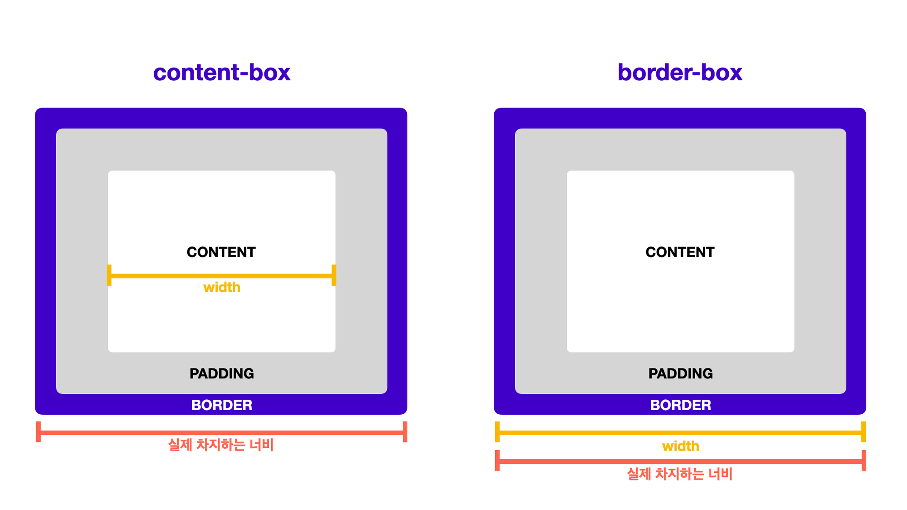
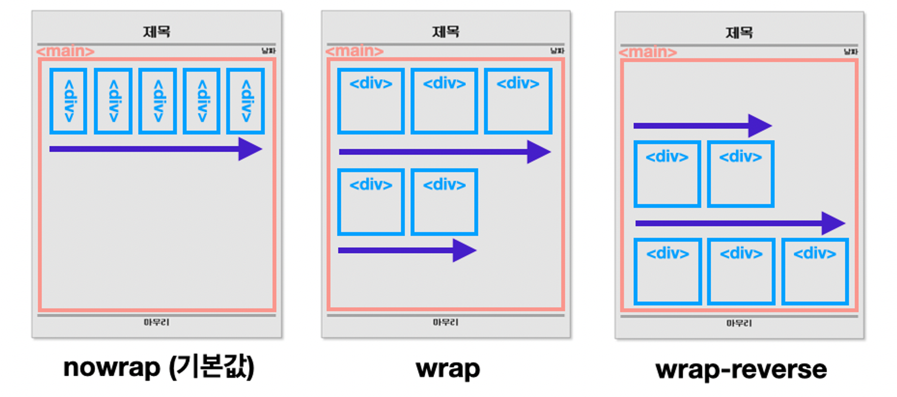
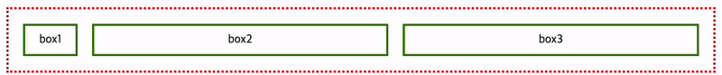

[오늘의 기록]<br/>
말로만 들었던 css를 처음 접했는데
쉬운듯 어려운듯하다
약간 노가다 같은 느낌<br/>
백엔드가 메인이라 바로 훅훅 지나가지만 
깊게 배워보면 재밌지 않을까..?

HTML의 태그를 잘 선택하여 꾸며줘야하다보니
선택자가 제일 중요하니 선택자는 꼭꼭 복습하기. 
<br/>
<br/>

# **CSS란 ?**

**CSS 는 웹 페이지 스타일 및 레이아웃을 정의하는 스타일시트 언어**

- HTML로 웹 페이지의 구조를 잘 세우고 나서, 더 나은 사용자 경험(UX, user experience)을 제공하기 위함
- CSS로 UI 및 레이아웃을 적절히 구성하면 멋진 웹 페이지를 완성할 수 있음


# BOX

| block | inline-block | inline |
| --- | --- | --- |
| 줄 바꿈 여부 | 줄 바꿈이 일어남 | 줄 바꿈이 일어나지 않음 |
| 기본적으로 갖는 너비(width) | 100% | 글자가 차지하는 만큼 |
| width, height 사용 가능 여부 | 가능 | 가능 |

![Untitled]
<br/>
<br/>

### ID와 Class 사용하여 페이지 만들기 예제

1. **id로 이름 붙여서 스타일링 적용하기**
    1. ex) html 요소 중 하나인 <h4>에 색상 적용
        
        
        ```css
        h4 {
          color: red;
        }
        ```
        
        
        
        
        
        1. 의도와는 다르게 navigation뿐만 아니라 aside에도 적용됨
        2. `<h4>` 요소를 정확하게 선택하기 위해서는 이 엘리먼트에 id를 붙여서 해결할 수 있음
        3. id가 있는 요소를 선택할 때는 `#`기호를 이용
        4. html에 적용
            
            ```html
            <h4 id="navigation-title">This is the navigation section.</h4>
            ```
            
        5. CSS에 적용
            
            ```css
            #navigation-title {
              color: red;
            }
            ```
            
2. **Class로 스타일을 분류하여 적용 : 하나의 class를 여러 요소에 적용**
    1.  navigation section의 자식 `<li>` 요소에 밑줄치기
        
        ```css
        li {
          text-decoration: underline;
        }
        ```
        
        1. 모든 li 요소에 밑줄 적용됨
            
            
            
    2.  navigation section의 모든 `<li>` 요소에 id를 추가하고 CSS를 적용
        
        ```html
        <!-- 잘못된 예제 -->
        <ul>
          <li id="menu-item">Home</li>
          <li id="menu-item">Mac</li>
          <li id="menu-item">iPhone</li>
          <li id="menu-item">iPad</li>
        </ul>
        ```
        
        1. **id는 문서 내에 단 하나의 요소에만 적용할 수 있는 유일한 이름**이어야 함. 따라서 이 예제는 id를 잘못 사용한 예제
    3. navigation section의 모든 `<li>` 요소에 class를 추가하고 CSS를 적용
        1. 여러 요소에 같은 스타일링을 적용하기 위해서는 class를 사용
            
            ```html
            <!-- 바른 예제 -->
            <ul>
              <li class="menu-item">Home</li>
              <li class="menu-item">Mac</li>
              <li class="menu-item">iPhone</li>
              <li class="menu-item">iPad</li>
            </ul>
            ```
            
        2. class menu-item을 선택하여 밑줄을 적용
            
            ```css
            .menu-item {
              text-decoration: underline;
            }
            ```
            
        
3. **여러 개의 class를 하나의 엘리먼트에 적용하기**
    - **요소를 만들거나, 요소에 스타일링을 적용할 때는 항상 이름과 목적이 일치하는지 확인**
    1.  하나의 요소에 여러 class를 적용하는 방법
        
        ```html
        <li class="menu-item selected">Home</li>
        ```
        
    2. 특정 클래스(selected)를 통해 요소를 스타일링하는 모습
        
        ```css
        .selected {
          font-weight: bold;
          color: #009999;
        }
        ```
        
        왜 menu-item selected가 아닌지 궁금했는데**`.menu-item selected`**는 존재하지 않는 후손 태그를 가리키는 잘못된 형태이고, **`.menu-item.selected`**나 **`.selected`**를 사용해야 함

</br>
</br>

### 절대단위 상대단위

글꼴 크기, 화면 크기 등 크기를 다룰 때는 크기의 **단위**가 무엇보다 중요,

크기의 단위는 절대 단위와 상대 단위, 두 가지로 구분

- 절대 단위: `px`, `pt`
- 상대 단위: `%`, `em`, `rem`, `ch`, `vw`, `vh` 등
    
    
1. 기기나 브라우저 사이즈 등의 환경에 영향을 받지 않는 절대적인 크기 ⇒px :  크기가 고정된 절대 단위이기 때문에 사용자 접근성이 불리
    1. 픽셀은 모바일 기기처럼 작은 화면이면서, 동시에 고해상도인 경우에도 적합하지 않습니다. 
2. 일반적인 경우 **상대 단위인 `rem`**을 추천.
    1.  root의 글자 크기, 즉 브라우저의 기본 글자 크기가 1rem이며, 두 배로 크게 하고 싶다면 2rem, 작게 하려면 0.8rem 등으로 조절해서 사용
    2. `em`은 부모 엘리먼트에 따라 상대적으로 크기가 변경되므로 계산이 어렵습니다. 
    3. 이에 비해 `rem`은 root의 글자 크기에 따라서만 상대적으로 변합니다.)
3. **화면 사이즈를 정할 때**
    1. 반응형 웹(responsive web)에서 기준점을 만들 때
        1. 반응형 웹은 디바이스의 너비(width)에 따라 유동적인 레이아웃이 적용되는 웹사이트
        2. 디바이스 크기별로 CSS를 달리 적용해야  함 ⇒  이때, 디바이스 크기를 나누는 기준을 보통 `px`로 정함
    2. 화면 너비나 높이에 따른 상대적인 크기가 중요한 경우 
        1. 이때에는 `vw`, `vh`를 사용 ⇒ 각각 viewport width와 viewport height를 뜻
        2. `1vw`는 보이는 영역 너비의 1/100을, `1vh`는 보이는 영역 높이의 1/100을 뜻
        3. 화면을 가득 채우며 딱 떨어지게 스크롤되는 사이트 → 이런 웹 페이지에서 사용하는 방법이 `100vw`, `100vh`를 사용해 구현한 것 
        4. 참고로 `<body>` 태그에서의 `%`는 HTML이 차지하는 모든 영역, 즉 지금은 보이지 않으나 스크롤했을 때 보이는 영역까지 포함했을 때 비율

</br>
</br>


# Selector

### 기본 선택자

1. 전체 선택자
    
    ```css
    * { }
    ```
    
2. 태그 선택자 : 같은 태그명을 가진 모든 요소를 선택, 복수로도 선택가능
    
    ```css
    h1 { }
    div { }
    
    section, h1 { }
    ```
    
3. ID 선택자 : `#id`
    
    ```css
    #only { }
    ```
    
4. Class 선택자 : `.class`로 입력하여 선택, 같은 class를 가진 모든 요소를 선택
    
    ```css
    .widget { }
    .center { }
    ```
    
5. attribute 선택자: 같은 속성을 가진 요소를 선택
    
    ```css
    a[href] { }
    p[id="only"] { }
    p[class~="out"] { }
    p[class|="out"] { }
    section[id^="sect"] { }
    div[class$="2"] { }
    div[class*="w"] { }
    ```
    

### 자식/후손/형제 선택자

1. 자식 선택자
    1. 첫 번째로 입력한 요소의 바로 아래 자식인 요소를 선택
    2. `<header>` 요소 바로 아래에 있는 두 개의 `<div>` 요소는 선택되지만, `<p>` 요소의 자식인 `<div>` 요소는 선택되지 않음
        
        ```css
        header > div { }
        ```
        
        ```html
        <header>
        	<div> <!-- 선택 -->
        		<p>
        			<div></div>
        		</p>
        	</div>
        	<div> <!-- 선택 -->
        		<p>
        			<div></div>
        		</p>
        	</div>
        </header>
        ```
        
2. 후손 선택자 : 첫 번째로 입력한 요소의 후손을 선택
    1. `<header>` 요소의 자식인 `<div>` 요소뿐 아니라, `<p>` 요소의 자식인 `<div>` 요소까지 모두 선택
        
        ```css
        header div {}
        ```
        
        ```html
        <header>
        	<div><!-- 선택 -->
        		<p>
        			<div><!-- !!선택!! -->
        			</div>
        		</p>
        	</div>
        	<div><!-- 선택 -->
        		<p>
        			<div><!-- !!선택!! -->
        			</div>
        		</p>
        	</div>
        </header>
        ```
        
3. 형제 선택자 : 같은 부모 요소를 공유하면서, 첫 번째 입력한 요소 뒤에 오는 두 번째 입력한 요소를 모두 선택
    
    ```css
    section ~ p { }
    ```
    
    ```html
    <header>
    	<section></section>
    	<p></p> <!-- 선택 -->
    	<p></p> <!-- 선택 -->
    	<p></p> <!-- 선택 -->
    </header>
    ```
    
4. 인접 형제 선택자
    
    ```css
    section + p { }
    ```
    
    ```html
    <header>
    	<section></section>
    	<p></p> <!-- 선택 -->
    	<p></p>
    	<p></p>
    </header>
    ```
    

### 기타 선택자

1. 가상 클래스 선택자
    
    ```css
    a:link { } /*사용자가 방문하지 않은 <a>요소를 선택합니다. 이 상태는 기본적으로 페이지가 처음 로드되었을 때 링크에 적용됩니다.*/
    a:visited { } /*사용자가 방문한 <a>요소를 선택합니다. 브라우저는 사용자가 방문한 링크를 기억하고 스타일을 다르게 적용합니다.*/
    a:hover { } /* 마우스를 요소 위에 올렸을 때 선택합니다. */
    a:active { } /* 활성화 된(클릭된) 상태일 때 선택합니다. */
    a:focus { } /* 포커스가 들어와 있을 때 선택합니다.  포커스는 키보드로 링크를 탐색할 때 발생합니다. (예: 탭 키 사용)*/
    ```
    
2. UI 요소 상태 선택자
    
    ```css
    input:checked + span { } /*체크 상태일 때 선택합니다. */
    input:enabled + span { } /*사용 가능한 상태일 때 선택합니다. */
    input:disabled + span { } /*사용 불가능한 상태일 때 선택합니다. */
    ```
    
3. 구조 가상 클래스 선택자
    
    ```html
    p:first-child { } /* 셀렉터는 부모 요소의 첫 번째 자식 요소가 <p>일 때 선택합니다. */
    
    ul > li:last-child { } /* ul 요소의 마지막 자식인 li 요소를 선택합니다. */
    <ul>
        <li>첫 번째 항목</li>
        <li>두 번째 항목</li>
        <li>마지막 항목</li>
    </ul>
    
    ul > li:nth-child(2n) { } /* ul 요소의 짝수 번째 자식인 li 요소를 선택합니다. */
    <ul>
        <li>첫 번째 항목</li>
        <li>두 번째 항목</li>
        <li>세 번째 항목</li>
        <li>네 번째 항목</li>
    </ul>
    
    section > p:nth-child(2n+1) { } /*  section 요소의 홀수 번째 자식인 p 요소를 선택합니다. */
    <section>
        <p>첫 번째 단락</p>
        <p>두 번째 단락</p>
        <p>세 번째 단락</p>
        <p>네 번째 단락</p>
    </section>
    ul > li:first-child { } /*  ul 요소의 첫 번째 자식인 li 요소를 선택합니다.*/
    <ul>
        <li>첫 번째 항목</li>
        <li>두 번째 항목</li>
        <li>세 번째 항목</li>
    </ul>
    
    li:last-child { } /* 부모 요소의 마지막 자식인 li 요소를 선택합니다. */
    <ul>
        <li>첫 번째 항목</li>
        <li>두 번째 항목</li>
        <li>마지막 항목</li>
    </ul>
    div > div:nth-child(4) { } /* div 요소의 네 번째 자식인 div 요소를 선택합니다. */
    <div>
        <div>첫 번째 div</div>
        <div>두 번째 div</div>
        <div>세 번째 div</div>
        <div>네 번째 div</div>
    </div>
    div:nth-last-child(2) { } /* 부모 요소의 뒤에서 두 번째 자식인 div 요소를 선택합니다. */
    <div>
        <div>첫 번째 div</div>
        <div>두 번째 div</div>
        <div>세 번째 div</div>
        <div>네 번째 div</div>
    </div>
    
    section > p:nth-last-child(2n + 1) { } /* 부모 요소의 뒤에서 홀수 번째 자식인 p 요소를 선택합니다. */
    p:first-of-type { } /* 형제 요소 중 첫 번째 <p> 요소를 선택합니다. */
    <div>
        <p>첫 번째 단락</p>
        <span>텍스트</span>
        <p>두 번째 단락</p>
    </div>
    
    div:last-of-type { } /* 형제 요소 중 마지막 <div> 요소를 선택합니다. */
    <div>
        <div>첫 번째 div</div>
        <span>텍스트</span>
        <div>마지막 div</div>
    </div>
    
    ul:nth-of-type(2) { } /* 형제 요소 중 두 번째 <ul> 요소를 선택합니다. */
    <ul>
        <li>첫 번째 목록</li>
    </ul>
    <ul>
        <li>두 번째 목록</li>
    </ul>
    p:nth-last-of-type(1) { } /* 형제 요소 중 마지막 <p> 요소를 선택합니다. */
    <div>
        <p>첫 번째 단락</p>
        <span>텍스트</span>
        <p>마지막 단락</p>
    </div>
    ```
    
4. 부정 선택자
    
    ```html
    input:not([type="password"]) { } /*  type 속성이 "password"가 아닌 모든 <input> 요소를 선택합니다. */
    <form>
        <input type="text" placeholder="Username">
        <input type="password" placeholder="Password">
        <input type="email" placeholder="Email">
        <input type="submit" value="Submit">
    </form>
    
    div:not(:nth-of-type(2)) { } /* 형제 요소들 중 두 번째 div 요소를 제외한 모든 div 요소를 선택합니다.*/
    <div>첫 번째 div</div>
    <div>두 번째 div</div>
    <div>세 번째 div</div>
    <div>네 번째 div</div>
    
    ```
    
5. 정합성 확인 선택자
    
    ```html
    input[type="text"]:valid { } /* 올바른 형식으로 입력된 텍스트 필드를 선택합니다. 즉, 유효한 값이 입력된 input 요소를 선택합니다.*/
    <form>
        <label for="username">Username (at least 3 characters):</label>
        <input type="text" id="username" name="username" pattern=".{3,}" required>
        <input type="submit" value="Submit">
    </form>
    
    input[type="text"]:invalid { } /*  올바르지 않은 형식으로 입력된 텍스트 필드를 선택합니다. 즉, 무효한 값이 입력된 input 요소를 선택합니다.*/
    <form>
        <label for="username">Username (at least 3 characters):</label>
        <input type="text" id="username" name="username" pattern=".{3,}" required>
        <input type="submit" value="Submit">
    </form>
    
    ```
    
<br/>
<br/>

# Flexbox

Flexbox 속성들을 활용하면 요소의 **정렬**, 요소가 **차지하는 공간**을 설정 가능

## 부모요소에 적용해야 하는 속성

`flex-direction`  `flex-wrap` `justify-content` 

### flex-direction : 정렬 축 정하기

자식 요소들을 정렬할 정렬 축을 정함

아무 설정도 해주지 않으면 **기본적으로 가로 정렬**



### **flex-wrap : 줄 바꿈 설정**

`flex-wrap` 속성은 하위 요소들의 크기가 상위 요소의 크기를 넘으면 자동 줄 바꿈을 할 것인지 정함. 

설정해 주지 않으면 **줄 바꿈을 하지 않음**



### **justify-content : 축 수평 방향 정렬**

자식 요소들을 축의 수평 방향으로 어떻게 정렬할 것인지 정함

소들이 가로로 정렬되어 있다면 가로 방향으론 어떻게 정렬할 것인지, 세로로 정렬되어 있다면 세로 방향으론 어떻게 정렬할 것인지 정하는 속성


`flex-direction : row` 인 경우 ↔


`flex-direction : column` 인 경우 ↕️


### **align-items : 축 수직 방향 정렬**

`align-items` 속성은 자식 요소들을 축의 수직 방향으로 어떻게 정렬할 것인지 정함

요소들이 가로로 정렬되어 있다면 세로 방향으론 어떻게 정렬할 것인지, 세로로 정렬되어 있다면 가로 방향으론 어떻게 정렬할 것인지 정하는 속성

`align items: row` 인 경우 


`align items: column` 인 경우 


## 자식요소에 적용해야 하는 속성

부모 요소에 적용해야 하는 속성들이 자식 요소들의 **정렬**과 관련이 있었다면, 

자식 요소에게 적용해야 하는 속성인 `flex`는 요소가 **차지하는 공간**과 관련이 있음

```css
flex:   <grow(팽창 지수)>    <shrink(수축 지수)>    <basis(기본 크기)>
```

기본값 :  **`flex: grow shrink basis`, `flex: 0 1 auto` 순서 기억하기**

```css
flex: 0 1 auto;
```

```css
flex-grow: 0;
flex-shrink: 1;
flex-basis: auto;
```

위 아래 코드는 같은 값이다.

1. glow : 상대크기 ==팽창지수의 절대적 크기가 아닌 **총합에서의 비율**로 빈 공간을 차지
    1. `flex` 속성을 설정하기 전
        
        
        
    2. `grow`의 기본 값인 0은 빈 공간이 있어도 늘어나지 않음을  의미
    3. box1만 `flex-grow : 1`로 설정, 나머지 박스는 `flex-grow : 0` 
        
        
        
    4. box1, box2도 `flex-grow : 1`로 설정. box3만 `flex-grow : 0`인 상태
        
        
        
    5. 세 박스 모두 `flex-grow : 1` 
        
        
        
2. **shrink -거의 안씀**
    1. grow와 반대로, 설정한 비율만큼 박스 크기가 작아짐
    2. 비율이 클수록 더 많이 줄어들게 됨.
    3. 그러나 `flex-grow` 속성과 `flex-shrink` 속성을 함께 사용하는 일은 추천하지 않음
    4. **`lex-grow` 속성으로 비율을 변경하는 경우, `flex-shrink` 속성은 기본값인 1로 두어도 무방**
3. basis : 기본크기
    1. `lex-grow`나 `flex-shrink`에 의해 늘어나거나 줄어들기 전에 가지는 기본 크기
    2. grow는 0 : 1 : 1로 설정하고, box1에 flex-basis : 50px, 
    
    
    
    box1의 크기가 늘어나거나 줄어들지 않고 50px을 유지