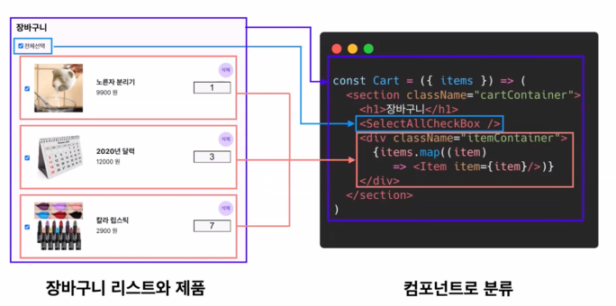
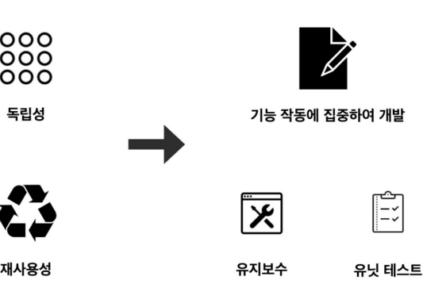

# React


### React : 프론트앤드 개발을 위한 JavaScript 오픈소스 라이브러리

framework - library의 집합체, 개발자가 뭘 만들기 위해 필요한 것을 집합해서 모아 놓은 것.

대표적인 framework - spring framework

react는 framework가 아님, react는 다른 기술과 같이 쓰는데 제약이 없음, 종속성이 없기 때문

### React의  3가지 특징

1. 선언형
2. 컴포넌트기반
3. 범용성 - 다양한 곳에서 활용할 수 있음, 단순히 react가 라이브러리 이기 때문

### 선언형 (Declarative)

리액트는 한 페이지를 보여주기위해 HTML /CSS /JS 로 나눠서 적기보다

하나의 파일에 명시적으로 작성할 수 있게 JSX를 활용한 선언형 프로그래밍을 지향

### 컴포넌트 기반 (Component -Baseed)✨✨✨

- 리액트는 하나의 기능 구현을 위해 여러 종류의 코드를 묶어둔 컴포넌트 기반으로 개발
    
    
    
    - JSX 문법 자체에서는 반복문 못 씀,  반복문 써야 하면 무조건 map
    - if도 사용 못함 써야 한다면 삼항 연산자만 사용 가능
- 컴포넌트로 분리하면 서로 독립적이고 재사용이 가능하기 때문에 기능 자체에 집중하여 개발할 수 있음
    
    
    

### 범용성(Learn Once, write Anywhere)

- 리액트는 JavaScript 프로젝트 어디에든 유연하게 적용할 수 있음
- Facebook에서 관리되어 안정적이고, 가장 유명하며, 리액트 네이티브로 모바일 개발도 가능.


## JSX(JavaScript Xml)

javascript는 브라우저가 읽을 수 있지만 (실제로 컴파일 안함)

JSX는 브라우저가 못 읽음, 컴파일이 필요 , 컴파일 시 Babel을 사용

Bable이 브라우저가 읽을 수 있는 언어로 변경해주는 역할을 함.


JS는 혼자 사용 못하고 HTML이 꼭 있어야 함, HTML 하단의 노란 박스가 JS와 연결해주는 코드

JSX는 바벨로 컴파일하면 HTML과 JS로 나뉘어짐.

### JSX 사용 이유

1. 한 눈에 볼 수 있는 기능과 디자인
    
    
    

### JSX 사용 예제

**App.js** 이 한 개의 JavaScript 파일 안에서 HTML과 JavaScript로 나누어졌던 두 가지 일을 한 번에 처리하고 있음

- js의 템플릿 리터럴
    
    
    
- jsx에서는 JS문법 사용시 중괄호를 사용해야 함.
    
    
    

### JSX 활용

1. JSX 규칙
    1. 하나의 엘리먼트 안에 모든 엘리먼트가 포함.
        
        
        
    2. 엘리먼트 클래스 사용시 , className으로 표시
        
        
        
    3. JavaScript 표현식 사용시 중괄호 이용
    4. 사용자 정의 컴포넌트는 대문자로 시작 (PascalCase)
        
        
        
    5. 조건부 렌더링에는 삼항연산자 사용
        
        
        
    6. 여러개의 HTML  엘리먼트를 표시할때 map() 함수를 이용

### **map을 이용한 반복**

1. 블로그를 예로 들 때 포스트가 100개이고 작성자가 작성할 때마다  만들 순 없음… 
    1. 이렇게 직접 모든 데이터를 코드에 작성하는 것을 하드코딩(hard coding)
        
        ```jsx
         const posts = [
            { id : 1, title : 'Hello World', content : 'Welcome to learning React!' },
            { id : 2, title : 'Installation', content : 'You can install React via npm.' },
            { id : 3, title : 'reusable component', content : 'render easy with reusable component.' },
            // ...
            { id : 100, title : 'I just got hired!', content : 'OMG!' },
          ];
        
        function Blog() {
          return (
            <div>
              <div>
                 <h3>{posts[0].title}</h3>
                 <p>{posts[0].content}</p>
             </div>
              <div>
                 <h3>{posts[1].title}</h3>
                 <p>{posts[1].content}</p>
              </div>
              {// ...}
              <div>
                 <h3>{posts[99].title}</h3>
                 <p>{posts[99].content}</p>
              </div>
             {// ... 98 * 4 more lines !!}
           </div>
          );
        }
        ```
        
2. **그래서 map을 이용하여 반복** 
    
    ```jsx
    function Blog() {
      const postToElement = (post) => (
        <div>
          <h3>{post.title}</h3>
          <p>{post.content}</p>
        </div>
      );
    
      const blogs = posts.map(postToElement);
    
      return <div className="post-wrapper">{blogs}</div>;
    }
    ```
    
    1.  **key 속성**의 위치는 `map` 메서드 내부에 있는 엘리먼트 즉, 첫 엘리먼트에 넣기
        1. key 없으면 에러 발생
            
            
            
        2. 아래와 같이 key를 넣어 주어야 함. 정 고유한 id가 없을 경우에만 배열 인덱스 넣어서 해결
            
            ```jsx
             function Blog() {
              // postToElement라는 함수로 나누지 않고 아래와 같이 써도 무방.
              const blogs = posts.map((post) => (
                **<div key={post.id}>**
                  <h3>{post.title}</h3>
                  <p>{post.content}</p>
                </div>
              ));
              return <div className="post-wrapper">{blogs}</div>;
            }
            ```
            

## Component

1. 컴포넌트의 정의
    1. 하나의 기능 구현을 위한 여러 종류의 코드 묶음
        
        
        
2. 컴포넌트를 여러 개  만들고 조합하면 어플리케이션 만들 수 있음
    
    
    

1. React DOM
    1. React  application은  컴포넌트들의 트리구조로 형성화하여 표현할 수 있음
    2. 트리구조 = 계층형 구조


1. 유투브를 컴포넌트로 생각해보기
    
    
    
    
    
    1. 각각의 컴포넌트는 각자 고유의 기능을 가지고 있으며 UI의 한 부분을 담당하고 있음.
    2. 이러한 컴포넌트를 한 곳에 모아 복잡한 UI구성할 수 있고
    3. 더 나아가 최종적으로 복잡한 어플리케이션도 만들 수 있음.
2. 컴포넌트 기반 개발의 장점
    1. React 없을 때는 이렇게 수정
        
        
        
    2. React 를 사용할때는 규모가 큰 application은 수정이나 구조 개선이 간편해짐.
        
        
        

### Create React App - 터미널 실습

**Create React App은 리액트 SPA를 쉽고 빠르게 개발 할 수 있도록 만들어진 툴 체인**

- 초기 프로젝트를 쉽게 만들 수 있게 지원
- but, 최근에 업데이트 지원을 더이상 하지 않는다고 함.
- 터미널에서 nmp 설치
    1. npm install npx-g
    2. npx create-react-app react-random-proverb
    3. y
    4. code . 
    
1. 실습 예제 -명언 10개를 배열로 만들고 ,랜덤으로 화면에서 명언이 표시되게 해보기
    1. 내가 구현한 것
        
        ```jsx
        function App() {
          const quotes = [
          "인생은 자신을 찾는 것이 아니라, 자신을 창조하는 것이다. - 조지 버나드 쇼",
          "성공은 성공하려는 의지에서 비롯된다. - 빈스 롬바르디",
          "변화는 고통스럽다. 하지만 아무것도 바꾸지 않는 것은 더 고통스럽다. - 존 맥스웰",
          "자신이 될 수 있는 것보다 더 낮게 자신을 평가하지 말라. - 미셸 오바마",
          "우리는 계속해서 나아가는 법을 배운다. - 월트 디즈니",
          "네가 두려워하는 일을 해라. 그리고 계속 그것을 해라. - 랄프 왈도 에머슨",
          "행복은 목적지가 아니라 여행의 방법이다. - 로이 굿맨",
          "성공의 비밀은 그 비밀을 찾는 것이다. - 헨리 포드",
          "매일 매일이 최고의 날이다. - 랄프 왈도 에머슨",
          "불가능을 실행하는 것은 그것을 믿는 자들에 의해 달성된다. - 나폴레옹 보나파르트"
          ];
        
          const currentProverb = quotes[Math.floor(Math.random()*10+1)];
        
          return (
            <div className="App">
              <header className="App-header">
                
                <p>
                  {currentProverb}
                </p>
                <a
                  className="App-link"
                  href="https://reactjs.org"
                  target="_blank"
                  rel="noopener noreferrer"
                >
                Learn React
        
                </a>
              </header>
            </div>
          );
        }
        
        export default App;
        ```
        
    2. 예외처리 안되어있고, 1000번 실행되도 1번의 오류가 없는 코드가 중요, 결함 장애가 있는 코드보다 성능이 안 좋아도 오류 없는 코드가 좋음
        
        ```jsx
        let idx = Math.round(Math.random()*10+1)
        idx = idx === 10? 0 : idx;
        ```
        
        - Math.random()은 0에서 1까지의 난수를 출력

# React SPA

## SPA (Single-Page Application)

1. 등장 배경 및 개념
    1. 전통적인 웹사이트는 페이지 이동 시 매번 전체 페이지를 불러와야 함.
        1. 전통적인 웹사이트의 한계와 단점
            - 사용자와 서비스 사이의 상호작용 증가는 트래픽 증가와 경험의 저하를 야기
            
            
            
    2. SPA 등장
        1. HTML문서 전체가 아니라 업데이트에 필요한 데이터만 받아 JavaScript가 데이터를 조장하여 HTML요소를 생성하여 화면에 보여주는 방식이 개발 됨.
            
            
            
        2. SPA는 업데이트가 필요한 부분만 새로 불러옴
2. SPA란
    1. 서버로부터 완전한 새로운 페이지를 불러오지 않고 페이지 갱신에 필요한 데이터만 받아 그 정보를 기준으로 현재의 페이지를 업데이트 함으로써 사용자와 소통하는 웹 어플리케이션 or 웹사이트
3. SPA의 장점
    1. 전체 페이지가 아니라 필요한 부분의 데이터만 받아서 화면을 업데이트 하면 되기 때문에 사용자오 Interaction에 빠르게 반응
        
        
        
    2. 서버에서는 요청받은 데이터만 넘겨주면 되기 때문에 서버 과부하 문제가 현저하게 줄어듬
    3. 전체 페이지를 렌더링 할 필요가 없기 때문에 더 나은 유저 경험을 제공 함.
4. SPA의 단점
    1. JavaScript 파일의 크기가 크기 때문에 기다리는 시간으로 인해 첫 화면 로딩시간이 길어짐
    2. 검색엔진 최적화 (SEO)가 좋지 않음
    3. 구글이나 네이버 같은 검색엔진은 HTML 파일에 있는 자료를 분석하는 방식으로 검색기능을 구동함. 하지만 SPA의 경우 HTML 파일은 별다른 자료가 없기 때문에 검색엔진이 적절히 동작하지 못함.
    
    ---
    
    참고 하기
    
    
    
- REST, RESTfull - 주고 받을 때 지켜야하는 양식.
- 클라이언트와 서버를 분리,
- 백엔드에서 보내주는 데이터가 제이슨
- 프론트에서 컴포넌트 변경은 react에서 하는 것,- 프론트 .구분되어야 함

---

### 와이어 프레임

1. Wireframe과 Mockup
    
    
    
    1. Wireframe
        - 웹페이지의 레이아웃과 UI 요소 등에 대한 뼈대
    2. Mockup → 의미는 꼭 기억하기
        - 데모 시연, 평가를 위한 최소한의 기능만 담은 모형
2. 페이지 구성
    1. 페이지 만들기 이전에, 컴포넌트 먼저 만들고 조립
        
        
        
    2. <Header/>
        
        
        
        <Header/>  컴포넌트는 어플리케이션의 어느 페이지에 가더라도 항상 화면 상단에 위치하고 있음. 그렇다면 모든 페이지마다 따로 만들어 줄 것이 아니라 한번만 만들어서 모든 페이지에서 사용할 수 있도록 로직을 짜기
        
    3. <ContentList/>한가지 컴포넌트를 만들어서 컨텐츠를 계속 재활용 함.
        
        
        
    4. 객체를 받아서 배열로 받음 - 백엔드 개발자의 영역.
        
        
        
        
        

## React Router

경로를 따라서 화면이 변경되는 것을 라우팅이라 함,


1. React Router 주요 컴포넌트
    
    
    
    ```jsx
    import{BrowserRouter, Routes, Route, Link}from "react-router-dom";
    ```
    
2. React Router 사용 환경 Setting
    1.  react - router 라이브러리 설치
        
        ```powershell
        #simpleroute 폴더에 React App 설치
        npx create-react-app simpleroute
        
        # react-router 라이브러리 설치
        npm install react-router-dom@^6.3.0
        ```
        
    2. App.js로 react-router 컴포넌트 꺼내오기
        
        ```jsx
        import{BrowserRouter, Routes, Route, Link}from "react-router-dom";
        ```
        
    3. React Router 사용 환경 세팅
        ```
        import './App.css';
        import { BrowserRouter, Routes,Route, Link} from 'react-router-dom';


        export default function App(){
            return (
                <BrowserRouter>
                    <div>
                        <nav>
                            <ul>
                                <li>
                                    <Link to="/">Home</Link>
                                </li>
                                <li>
                                    <Link to="/about">Home</Link>
                                </li>
                                <li>
                                    <Link to="/dashboard">Home</Link>
                                </li>
                            </ul>
                        </nav>
                        <Routes>
                            <Route path ="/" element={<Home/>}/>
                            <Route path ="/mypage" elemnet={<MyPage/>}/>
                            <Route path ="/dashboard" element={<Dashboard/>}/>
                        </Routes>
                    </div>
                </BrowserRouter>
                );
            }

        function Home(){
            return <h1>Home</h1>;
        }

        function MyPage(){
            return <h1>MyPage</h1>;
        }

        function Dashboard(){
            return <h1>DashBoard</h1>;
        }
        ```