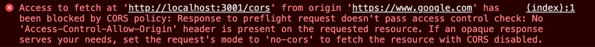

### SSR, CSR

   1. SSR (Server Side Rendering)
         1. Javascript 가 웹 페이지를 서버에서 렌더링 (=조립 완료된 가구가 배송되는 것과 비슷)
         2. 네이버 블로그- 2020년에 도입, 검색엔진 최적화를 위해 전체를 SSR로 변경
   2. CSR (Client Side Rendering)
         1. ↔ SSR 
         2. SSR이 서버 측에서 Javascript 가 페이지를 렌더링한다면, CSR은 클라이언트에서 Javascript 가 페이지를 렌더링 (=가구의 부품이 나눠서 운송이 쉽게 배송되는 것과 비슷)
         3. 웹 페이지의 골격이 될 단일 페이지를 클라이언트에게 보냄 이때 서버는 웹 페이지와 함께 JavaScript 파일을 보냄
         4. 검색엔진 최적화 - 0점
         5. CSR에서는 SSR과 다르게, 서버가 웹 페이지를 다시 보내지 않습니다
         6. 에이젝스 기술을 사용하는 이점이 있음. ⇒ 사용자의 편리성.
         7. 예제
            1. Agoda - 검색엔진 노출 대신에 마케팅으로 노출

## CORS

- **Cross-Origin Resource Sharing, 교차 출처 리소스 공유**
- 서로 다른 Origin을 가진 Application이 서로의 Resource에 접근할 수 있도록 해줌



> 서로 다른 Origin을 가진 애플리케이션에서 자원을 공유할 때 문제가 생김 ⇒ 만약에 다른 사용자가 내 사이트의 이미지를 링크로 접근 - 다른데서 사용 시 할 때마다 리소스가 들게 됨 ⇒ 클라이언트(브라우저)와 서버 간에 HTTP를 요청 시 서버가 HTTP와 너는 허용 같은 걸 담아서 같이 보내는데 만약에 Origin이 다를 경우 CORS 오류 발생

- 브라우저가 둘 다 [naver.com](http://naver.com) 일 경우 발생하지 않고 [naver.com](http://naver.com) 가 [kakao.com](http://kkao.com) 에 요청할 경우 발생
- CORS는 브라우저에서 발생, 특정 브라우저를 사용한다고 CORS가 사라지지 않음.
- CORS 설정은 서버에서 함.
- CORS 전체 허용하면 안됨 ⇒ 왜? ⇒ 보안취약점을 노린 공격

   ### 출처(Origin)란?

   - 출처(Origin)란 URL 구조에서 살펴본 Protocal, Host, Port를 합친 것

   

   - 출처를 알고 싶은 사이트에서 F12 누르고 콘솔 창에 `location.origin`를 실행하면 출처를 확인

   

   - 같은 출처 vs 다른 출처

   현재 웹페이지의 주소가 `https://quokkavely.github.io/tech/` 일때 

   | URL                                       | 결과      | 이유                      |
   | ----------------------------------------- | --------- | ------------------------- |
   | https://quokkavely.github.io/about        | 같은 출처 | Protocol, Host, Port 동일 |
   | https://quokkavely.github.io/about?q=work | 같은 출처 | Protocol, Host, Port 동일 |
   | https://quokkavely.github.io/about#work   | 같은 출처 | Protocol, Host, Port 동일 |
   | http://quokkavely.github.io               | 다른 출처 | Protocol 다름             |
   | https://quokkavely.github.io:81/about     | 다른 출처 | Port 다름                 |
   | https://quokkavely.heroku.com             | 다른 출처 | Host 다름                 |

   ### 동일 출처 정책(Same-Origin Policy)

   - 브라우저가 동일 출처 정책(Same-Origin Policy, SOP)를 지켜서 다른 출처의 리소스 접근을 금지함

   

   아고다에서 개발자모드에 들어가면 cors설정 볼 수 있음

   - 장점

   - [XSS](https://ko.wikipedia.org/wiki/%EC%82%AC%EC%9D%B4%ED%8A%B8_%EA%B0%84_%EC%8A%A4%ED%81%AC%EB%A6%BD%ED%8C%85)나 [XSRF](https://ko.wikipedia.org/wiki/%EC%82%AC%EC%9D%B4%ED%8A%B8_%EA%B0%84_%EC%9A%94%EC%B2%AD_%EC%9C%84%EC%A1%B0) 등의 보안 취약점을 노린 공격을 방어
   - 외부 리소스를 사용하기 위한 SOP의 예외 조항이 **CORS**

## CORS 동작원리

   ### Simple request

   

   - 바로 요청해서 바로 응답을 받는 것

   ---

   아래 조건에 해당되는 경우에만 가능함. - 1~3 번의 조건을 모두 충족해야 함

   1. 요청 메서드(method) : 3개 중 하나에 해당 되어야 함,
      1. GET
      2. HEAD
      3. POST
   2. 헤더
      1. Accept, Accept-Language, Content-Language, Content-Type, DPR, Downlink, Save-Data, Viewport-Width, Width 를 제외한 헤더를 사용하면 안 됨
   3. Content-Type 헤더
      1. application/x-www-form-urlencoded, multipart/form-data, text/plain 중 하나를 사용
      2. 아마 JSON 타입을 사용할 경우 Simple request는 사용 못함

   ### Preflight request

   

   - Preflight 요청은 실제 리소스를 요청하기 전에 **`OPTIONS`라는 메서드**를 통해 실제 요청을 전송할지 판단
   - `OPTIONS` 메서드로 서버에 예비 요청을 먼저 보내고, 서버는 이 예비 요청에 대한 응답으로 `Access-Control-Allow-Origin` 헤더를 포함한 응답을 브라우저에 보냄
   - 브라우저는 단순 요청과 동일하게 `Access-Control-Allow-Origin` 헤더를 확인해서 CORS 동작을 수행할지 판단

   ### CORS 에러 해결 방법

   - 앞에서 이야기 한 CORS 동작 원리를 보면, 서버에서 `Access-Control-Allow-Origin` 헤더를 포함한 응답을 브라우저에 보내는 방식으로 CORS 에러를 해결가능.
   - 프론트엔드 개발자가 CORS 에러를 확인했다면, 서버에 `Access-Control-Allow-Origin` 등 CORS를 해결하기 위한 몇 가지 응답 헤더를 포함해 달라고 요청해야 함.

   ### HTTP 요청 헤더

   - CORS를 위해서, 브라우저에서 서버로 요청하는 헤더

   - 요청 헤더들은 별도로 명시해 주지 않아도 브라우저에서 `OPTIONS` 요청에 추가

   - OPTIONS→ 절대 까먹으면 안됨.

      1. Origin: <origin>
         1. `Origin` 헤더는 요청하는 대상의 출처를 나타냄
         2. API를 호출하는 페이지의 출처 값이 저장됩니다.
      2. Access-Control-Request-Method: <method>
         1. `Access-Control-Request-Method` 헤더는 실제 요청이 어떤 HTTP 메서드를 사용하는지 서버에 알려주기 위해 사용
      3. Access-Control-Request-Headers: <field-name>[, <field-name>]
         1. `Access-Control-Request-Headers` 헤더는 브라우저에서 보내는 커스텀 헤더 이름을 서버에 알려주기 위해 사용

### HTTP 응답헤더

라이브러리 사용하면 간단하게 CORS를 해결 할 수 있음

#### **응답헤더 종류**

| HTTP 응답 헤더                                               | description                                                  | Syntax                                                       | 비고                                                         |
| ------------------------------------------------------------ | ------------------------------------------------------------ | ------------------------------------------------------------ | ------------------------------------------------------------ |
| Access-Control-Allow-Origin: <origin>                        | *                                                            | 헤더에 작성된 출처만 브라우저가 리소스를 접근할 수 있도록 허용 | Access-Control-Allow-Origin: *                               |
| Access-Control-Allow-Origin: <origin>                        |                                                              |                                                              |                                                              |
| Access-Control-Allow-Origin: null                            |                                                              |                                                              |                                                              |
| Access-Control-Allow-Methods: <method>[, <method>]*          | 리소스에 접근할 때 허용되는 메서드를 지정                    | Access-Control-Allow-Methods:                                |                                                              |
| POST, GET, OPTIONS                                           |                                                              |                                                              |                                                              |
| Access-Control-Allow-Methods: *                              | preflight request 대한 응답(Access-Control-Request-Method)   |                                                              |                                                              |
| Access-Control-Expose-Headers                                | cross-origin request에 대한 응답으로 브라우저에서 실행 중인 스크립트가 사용할 수 있는 응답 헤더를 지정 가능 | Access-Control-Expose-Headers: [<header-name>[, <header-name>]*] |                                                              |
| Access-Control-Expose-Headers: *                             | cross-origin request에 대한 응답                             |                                                              |                                                              |
| Access-Control-Allow-Headers                                 | 실제 요청때 사용할 수 있는 HTTP 헤더의 목록을 나열           | Access-Control-Allow-Headers: <header-name>[, <header-name>]* |                                                              |
| Access-Control-Allow-Headers: *                              | preflight request의 응답에 사용되는 헤더,                    |                                                              |                                                              |
| 클라이언트가 서버에 요청할 때 어떤 헤더들을 포함할 수 있는지 서버가 명시하는 것. |                                                              |                                                              |                                                              |
| Access-Control-Max-Age                                       | preflight request의 결과를 얼마나 오래 캐시할 수 있는지를 나타냄 | Access-Control-Max-Age: <delta-seconds>                      | preflight request의 결과(즉, Access-Control-Allow-Methods 및 Access-Control-Allow-Headers 헤더에 포함된 정보) |
| Access-Control-Allow-Credentials:true                        | Request.credentials가 include일때, 브라우저들이 응답을 프로트엔드 자바스트립트 코드에 노출할지에 대해 알려 | Access-Control-Allow-Credentials: true, false일 경우 헤더 생략 | Access-Control-Allow-Credentials 값이 true 일 경우에만 브라우저들은 프로트엔드 자바스트립트에 응답을 노출함 |

1. **Access-Control-Allow-Origin: <origin> | ***

   1.1 헤더에 작성된 출처만 브라우저가 리소스를 접근할 수 있도록 허용

   1.2 사용 방법

      - Access-Control-Allow-Origin: https://quokkavely.github.io
      - https://quokkavely.github.io 페이지에서 브라우저는 서버 응답으로 온 리소스를 접근할 수 있음
      - Access-Control-Allow-Origin: *  : *(와일드카드)가 작성되었다면 브라우저는 출처에 상관없이 모든 리소스에 접근 가능

   1.3 예제

      ```java
      fetch('http://localhost:3001/cors', {
        method: 'PUT',
      }).then(function(response) {
      }).catch(function(error) {
      })
      ```

      - `Access-Control-Allow-Origin` 헤더를 처리하지 않은 서버에 API 호출 시 에러 발생 함.

2. **Access-Control-Allow-Methods: <method>[, <method>]***

   2.1 리소스 접근을 허용하는 HTTP 메서드를 지정해 주는 헤더

   2.2 Access-Control-Allow-Methods 헤더에 GET, PUT, POST, DELETE 등의 HTTP 메서드를 ,로 구분하여 넘겨줌

      Ex) `Access-Control-Allow-Methods: GET, PUT`

   2.3 예제

      ```java
      fetch('http://localhost:3001/cors', {
        method: 'PUT',
      }).then(function(response) {
      }).catch(function(error) {
      })
      ```

   2.4 `Access-Control-Allow-Methods` 헤더를 처리하지 않은 서버에 API를 호출⇒ 에러 발생,  

      응답 헤더를 추가해주어야 함.

      ```java
      @RestController
      public class CorsController {
      
          @CrossOrigin(origins = "*", methods = {RequestMethod.OPTIONS, RequestMethod.PUT})
          @RequestMapping(value = "/cors", method = RequestMethod.OPTIONS)
          public ResponseEntity<?> handleOptionsRequest() {
              return ResponseEntity.ok().build();
          }
      
          @CrossOrigin(origins = "*", methods = {RequestMethod.OPTIONS, RequestMethod.PUT})
          @RequestMapping(value = "/cors", method = RequestMethod.PUT)
          public ResponseEntity<?> handlePutRequest() {
              return ResponseEntity.ok().build();
          }
      }
      ```

      `Access-Control-Allow-Origin`는 `*`로 모든 출처를 허용한 상태이고, 브라우저의 요청 헤더에 포함된 `Access-Control-Request-Method` 헤더 값을 그대로 `Access-Control-Allow-Methods` 헤더에 추가

3. Access-Control-**Expose**-Headers: <header-name>[, <header-name>]*

   3.1 `Access-Control-Allow-Headers` 헤더는 클라이언트가 실제 요청을 보내기 전에 서버에 보내는 **사전 요청(preflight request)에서 사용**

   3.2 이 헤더는 서버가 허용하는 요청 헤더의 목록을 지정 = 클라이언트가 서버에 요청할 때 어떤 헤더들을 포함할 수 있는지 서버가 명시

   3.3 사용방법 : `Access-Control-Expose-Headers: X-My-Custom-Header, X-Another-Custom-Header`

   3.4 예제

      ```java
      @RestController
      public class CorsController {
      
          @RequestMapping(value = "/cors", method = RequestMethod.OPTIONS)
          public ResponseEntity<?> handleOptionsRequest(@RequestHeader("Access-Control-Request-Method") String requestMethod) {
              HttpHeaders headers = new HttpHeaders();
              headers.set("Access-Control-Allow-Origin", "*");
              headers.set("Access-Control-Allow-Methods", requestMethod);
              return ResponseEntity.ok().headers(headers).build();
          }
      
          @RequestMapping(value = "/cors", method = RequestMethod.PUT)
          public ResponseEntity<?> handlePutRequest() {
              HttpHeaders headers = new HttpHeaders();
              headers.set("Access-Control-Allow-Origin", "*");
              headers.set("Access-Control-Expose-Headers", "X-Custom-Beomy");
              headers.set("X-Custom-Beomy", "Bemoy");
              return ResponseEntity.ok().headers(headers).build();
          }
      }
      ```

      3.4.1. 서버에서 `Access-Control-Expose-Headers` 헤더에 `X-Custom-Beomy`를 추가해 주고, `X-Custom-Beomy` 헤더에 값을 담아 응답을 하면

      3.4.2 브라우저에서는 아래코드를 실행해서 `X-Custom-Beomy` 헤더 값을 가져올 수 있게 됨

         ```java
         fetch('http://localhost:3001/cors', {
           method: 'PUT',
         }).then(function(response) {
           console.log(response.headers.get('X-Custom-Beomy')) // Beomy
         }).catch(function(error) {
         })
         ```

      3.4.3. 자바스크립트에서 접근할 헤더를 명시해 주지 않으면, 자바스크립트에서 `X-Custom-Beomy` 헤더 값은 `undefined`

4. Access-Control-**Allow**-Headers: <header-name>[, <header-name>]*

   4.1 브라우저에서 보내는 요청 헤더에 포함된 `Access-Control-Request-Headers` 헤더에 대한 응답 결과

   4.2 이 헤더를 사용하면 서버는 추가 헤더를 클라이언트에 노출가능 

   4.3 사용방법

   4.4 예시

      1. 자바스크립트에서 커스텀 헤더를 서버에 전달하게 되면, `OPTIONS` 요청 헤더의 `Access-Control-Request-Headers` 헤더에 커스텀 헤더 이름이 추가됩니다. 서버에서는 `Access-Control-Request-Headers`에 작성된 값을 보고 `Access-Control-Allow-Headers` 응답 헤더에 커스텀 헤더 이름을 명시해 주어야 합니다.

      2. `Access-Control-Allow-Headers: X-Custom-Request`

      3. 아래 코드를 브라우저에서 실행하여, `Access-Control-Allow-Headers` 처리되지 않은 API를 호출하게 되면,

         ```java
         fetch('http://localhost:3001/cors', {
           method: 'PUT',
           headers: {
             'X-Custom-Request': 'Beomy',
           }
         }).then(function(response) {
         }).catch(function(error) {
         })
         ```

      4. 아래와 같은 에러가 발생

         

      5. 응답헤더 추가 해줘야함

         ```java
         @RestController
         public class CorsController {
         
             @RequestMapping(value = "/cors", method = RequestMethod.OPTIONS)
             public ResponseEntity<?> handleOptionsRequest(
                     @RequestHeader("Access-Control-Request-Method") String requestMethod,
                     @RequestHeader("Access-Control-Request-Headers") String requestHeaders) {
                 HttpHeaders headers = new HttpHeaders();
                 headers.set("Access-Control-Allow-Origin", "*");
                 headers.set("Access-Control-Allow-Methods", requestMethod);
                 headers.set("Access-Control-Allow-Headers", requestHeaders);
                 return ResponseEntity.ok().headers(headers).build();
             }
         
             @RequestMapping(value = "/cors", method = RequestMethod.PUT)
             public ResponseEntity<?> handlePutRequest(@RequestHeader("X-Custom-Request") String customRequest) {
                 System.out.println(customRequest); // Beomy
                 HttpHeaders headers = new HttpHeaders();
                 headers.set("Access-Control-Allow-Origin", "*");
                 return ResponseEntity.ok().headers(headers).build();
             }
         }
         ```

         - 브라우저의 자바스크립트에서 `X-Custom-Request` 헤더에 `Beomy` 값을 서버에 전달하였고, 서버에서는 `Access-Control-Allow-Headers` 헤더에 `Access-Control-Request-Headers` 헤더 값을 저장하여 서버에서 `X-Custom-Request` 값을 사용할 수 있게 한 코드

5. Access-Control-Max-Age: <delta-seconds> - 언제까지 살아남을 수 있는지

   1. 사용방법 : 아래와 같이 초 단위로 캐시 시간을 설정합니다

      1. `Access-Control-Max-Age: 60`
         - 위의 코드는 60초 동안 preflight 요청을 캐시 하는 코드.
         - 60초 동안 `OPTIONS` 메서드를 사용하는 예비 요청을 보내지 않음

   2. 예제

      ```java
      fetch('http://localhost:3001/cors', {
        method: 'PUT'
      }).then(function(response) {
      }).catch(function(error) {
      })
      ```

      ```java
      @RestController
      public class CorsController {
      
          @RequestMapping(value = "/cors", method = RequestMethod.OPTIONS)
          public ResponseEntity<?> handleOptionsRequest(
                  @RequestHeader("Access-Control-Request-Method") String requestMethod) {
              HttpHeaders headers = new HttpHeaders();
              headers.set("Access-Control-Allow-Origin", "*");
              headers.set("Access-Control-Allow-Methods", requestMethod);
              headers.set("Access-Control-Max-Age", "60");
              return ResponseEntity.ok().headers(headers).build();
          }
      
          @RequestMapping(value = "/cors", method = RequestMethod.PUT)
          public ResponseEntity<?> handlePutRequest() {
              HttpHeaders headers = new HttpHeaders();
              headers.set("Access-Control-Allow-Origin", "*");
              return ResponseEntity.ok().headers(headers).build();
          }
      }
      ```

6. Access-Control-Allow-Credentials: true

   1. 인증정보를 담아서 보낼 수 있는지 오류가나면 true로 보내면 해결할 수 잇음. (Credential: 자격증명)

   2. 브라우저에서 쿠키같은 걸 사용하는데 허용하는지를 담는 것.

      - 개발자도구에서 쿠키확인 가능. 쿠키는 브라우저가 관리

      

   3. 사용방법

      `Access-Control-Allow-Credentials: true`

   4. 예제

      ```java
      fetch('http://localhost:3001/cors', {
        method: 'PUT',
        credentials: 'include'
      }).then(function(response) {
      }).catch(function(error) {
      })
      ```

      1. 아래와 같은 에러가 발생

         

      2. 서버에서 아래와 같이 응답 헤더를 추가해 주어야 함

         ```java
         @RestController
         public class CorsController {
         
             @RequestMapping(value = "/cors", method = RequestMethod.OPTIONS)
             public ResponseEntity<?> handleOptionsRequest(
                     @RequestHeader("Access-Control-Request-Method") String requestMethod) {
                 HttpHeaders headers = new HttpHeaders();
                 headers.set("Access-Control-Allow-Origin", "https://www.google.com");
                 headers.set("Access-Control-Allow-Methods", requestMethod);
                 headers.set("Access-Control-Allow-Credentials", "true");
                 return ResponseEntity.ok().headers(headers).build();
             }
         
             @RequestMapping(value = "/cors", method = RequestMethod.PUT)
             public ResponseEntity<?> handlePutRequest() {
                 HttpHeaders headers = new HttpHeaders();
                 headers.set("Access-Control-Allow-Origin", "https://www.google.com");
                 headers.set("Access-Control-Allow-Credentials", "true");
                 return ResponseEntity.ok().headers(headers).build();
             }
         }
         ```

      3. `Access-Control-Allow-Credentials: true` 추가 뿐만 아니라, `Access-Control-Allow-Origin` 헤더도 `*`(와일드카드)가 아닌 출처를 명시해 주어야 합니다.

## HTTP(HyperText Transfer Protocol)

- HTML과 같은 문서를 전송하기 위한 [Application Layer](https://en.wikipedia.org/wiki/Application_layer) 프로토콜

- HTTP는 웹 브라우저와 웹 서버의 소통을 위해 디자인 됨.

- 전통적인 클라이언트-서버 모델에서 클라이언트가 HTTP messages 양식에 맞춰 요청을 보내면, 서버도 HTTP messages 양식에 맞춰 응답함

- HTTP는 특정 상태를 유지하지 않는 특징이 있음 ,**Stateless(무상태성)**

  <aside>
  💗 Stateless
  HTTP는 무상태성이므로 클라이언트와 서버가 통신을 주고받는 과정에서, HTTP가 클라이언트나 서버의 상태를 확인하지 않음


  상태를 기억하기 위해서 브라우저의 공간을 사용

  Ex ) 쿠키,인증정보를 다른 형태로 바꿈(민감한정보를 담을 수 없으니 토큰형태로 담 -JWT (JSON WEB TOKEN)

  </aside>

### HTTP Message

1. 클라이언트와 서버 사이에서 데이터가 교환되는 방식

2. 두가지 유형

   1. 요청(Requests)
   2. 응답(Responses)

3. 구조

   

   - 몇 줄의 텍스트 정보로 구성
   - 직접 작성 필요 없음 ⇒ 구성파일, API, 기타 인터페이스에서 자동으로 완성함
   - 요청과 응답은 다음과 같은 유사한 구조를 가짐
     1. **start line**
        1. 요청이나 응답의 상태를 나타냄 
        2. 항상 첫 번째 줄에 위치
        3. 응답에서는 status line이라고 부릅니다.
     2. **empty line** - 헤더와 본문을 구분하는 역할.
     3. **body**
        1. 요청과 관련된 데이터나 응답과 관련된 데이터 또는 문서를 포함
        2. 요청과 응답의 유형에 따라 선택적으로 사용
     4. 이 중 start line과 HTTP headers를 묶어 요청이나 응답의 헤드(head)라고 하고, [payload](https://ko.wikipedia.org/wiki/%ED%8E%98%EC%9D%B4%EB%A1%9C%EB%93%9C_(%EC%BB%B4%ED%93%A8%ED%8C%85))는 body라고 이야기 함

### 요청

HTTP 요청은 클라이언트가 서버에 보내는 메시지

### 1. start line

- 3가지 요소가 있음
  1. Mehtod = HTTP METHOD ⇒ 수행할 작업이나 방식을 설명
     1. GET, POST, DELETE, PUT = CRUD
     2. HEAD or OPTIONS 
  2. 자원 = 요청하는 주소
     1. 일반적으로 (URL이나 URI) 또는 프로토콜, 포트, 도메인의 절대 경로
     2. 예제
        1. origin 형식 
           - `?` 와 쿼리 문자열이 붙는 절대 경로
           - POST, GET, HEAD, OPTIONS 등의 method와 함께 사용
           - `POST / HTTP 1.1 GET /background.png HTTP/1.0 HEAD /test.html?query=alibaba HTTP/1.1 OPTIONS /anypage.html HTTP/1.0`
        2. absolute 형식 
           - 완전한 URL 형식으로, 프록시에 연결하는 경우 대부분 GET method와 함께 사용
           - `GET <http://developer.mozilla.org/en-US/docs/Web/HTTP/Messages> HTTP/1.1`
        3. authority 형식
           - 도메인 이름과 포트 번호로 이루어진 URL의 authority component
           - HTTP 터널을 구축하는 경우, `CONNECT`와 함께 사용가능
             `CONNECT developer.mozilla.org:80 HTTP/1.1`
  3. start line에 HTTP 버전을 함께 입력
     1. HTTP 버전에 따라 HTTP message의 구조가 달라짐

### Header

- 기본구조에 따름

- 헤더 이름(대소문자 구분이 없는 문자열), 콜론( : ), 값을 입력

- 값은 헤더에 따라 다름 → 여러 종류의 헤더가 있고, 다음과 같이 그룹을 나눌 수 있음

  

1. General headers 
   1. 메시지 전체에 적용되는 헤더, body를 통해 전송되는 데이터와는 관련이 없는 헤더
2. Request headers
   1. fetch를 통해 가져올 리소스나 클라이언트 자체에 대한 자세한 정보를 포함하는 헤더를 의미
   2. User-Agent, Accept-Type, Accept-Language과 같은 헤더는 요청을 보다 구체화 함. 
   3. Referer처럼 컨텍스트를 제공하거나 If-None과 같이 조건에 따라 제약을 추가가능
3. Representation headers  (=이전에 Entity headers라 불림)
   1. body에 담긴 리소스의 정보(콘텐츠 길이, MIME 타입 등)를 포함하는 헤더

### Body

- HTTP messages 구조의 마지막에 위치,
- 모든 요청에 body가 필요하진 않음.(GET, HEAD, DELETE, OPTIONS처럼 서버에 리소스를 요청하는 경우는 필요없음) ⇒ **Request일 때 get 요청은 바디에 어떤 정보를 담을 수 없음 (get은 조회이기 때문에)**
- POST나 PUT과 같은 일부 요청은 데이터를 업데이트하기 위해 사용
- 보편적으로 JSON 으로 보냄
- 두 종류로 나눌 수 있음
  1. Single-resource bodies(단일-리소스 본문): 
     1. 헤더 두 개(Content-Type과 Content-Length)로 정의된 단일 파일로 구성
  2. Multiple-resource bodies(다중-리소스 본문) : 
     1. 여러 파트로 구성된 본문에서는 각 파트마다 다른 정보를 지님 
     2. 보통 [HTML form](https://developer.mozilla.org/en-US/docs/Learn/Forms)과 관련이 있습니다. - form은 이제 안씀.

### 응답

### **Status line**

응답의 첫 줄은 Status line이라고 부르며, 다음의 정보를 포함

1. 현재 프로토콜의 버전(HTTP/1.1)
2. 상태 코드 - 요청의 결과를 나타냅니다. (200, 302, 404 등)
3. 상태 텍스트 - 상태 코드에 대한 설명

Status line은 `HTTP/1.1 404 Not Found.`처럼 생겼습니다.

### **Headers**

응답에 들어가는 HTTP headers는 요청 헤더와 동일한 구조를 가짐

그룹으로 나눌 수 있음


1. General headers
   1. 메시지 전체에 적용되는 헤더로, body를 통해 전송되는 데이터와는 관련이 없는 헤더
2. Response headers 
   1. 위치 또는 서버 자체에 대한 정보(이름, 버전 등)와 같이 응답에 대한 부가적인 정보를 갖는 헤더로, Vary, Accept-Ranges와 같이 상태 줄에 넣기에는 공간이 부족했던 추가 정보를 제공
3. Representation headers 
   1. body에 담긴 리소스의 정보(콘텐츠 길이, MIME 타입 등)를 포함하는 헤더

### Body

201, 204와 같은 상태 코드를 가지는 응답에는 본문이 필요없음. 

응답의 body는 두 종류

1. Single-resource bodies(단일-리소스 본문)
   - 길이가 알려진 단일-리소스 본문은 두 개의 헤더(Content-Type, Content-Length)로 정의
   - 길이를 모르는 단일 파일로 구성된 단일-리소스 본문은 Transfer-Encoding이 `chunked`로 설정되어 있으며, 파일은 chunk로 나뉘어 인코딩되어 있음
2. Multiple-resource bodies(다중-리소스 본문) 
   - 서로 다른 정보를 담고 있는 body

### HTTP 상태 코드 - 외우기

오류메세지는 스프링에서 ENUM Class 만들어서 사용
더 많은 HTTP 상태코드는 링크참조 : https://developer.mozilla.org/ko/docs/Web/HTTP/Status

✔️✨하기 표는 꼭 외워야하는 상태코드!

| HTTP 상태코드 |                            |      | name                | description                                                  |
| ------------- | -------------------------- | ---- | ------------------- | ------------------------------------------------------------ |
| 100번대       | 어떤 정보를 표시할 때 사용 |      |                     |                                                              |
| 200번대       | 성공했을때 사용하는 코드   | 200  | OK                  | 요청이 성공적으로 수행되었습니다.                            |
|               |                            | 201  | Created             | 리소스를 생성하는 요청이 성공적으로 수행되었습니다.          |
|               |                            | 202  | Accepted            | 요청이 접수되었는데, 완전히 처리되진 않았습니다.             |
|               |                            | 204  | No Content          | 요청이 성공적으로 수행되었으나, 응답할 데이터가 없습니다.    |
| 300번대       | Redirection                | 301  | Moved Permanently   | 리소스의 위치가 변경되었음을 알려줍니다. 새로운 리소스의 위치를 함께 반환합니다. |
|               |                            | 302  | Found               | 리소스의 위치가 임시로 변경되어서, 임시 주소로 요청을 보냅니다. |
| 400번대       | 클라이언트 오류            | 400  | Bad Request         | 요청이 잘못되었습니다.                                       |
|               |                            | 401  | Unauthorized        | 인증이 필요합니다. 클라이언트에서 인증 정보를 포함해서 보내야 합니다. |
|               |                            | 403  | Forbidden           | 권한이 없습니다.                                             |
|               |                            | 404  | Not Found           | 요청한 리소스를 찾을 수 없습니다.                            |
|               |                            | 405  | Method Not Allowed  | 이 메서드는 사용할 수 없습니다.                              |
| 500번대       | 서버오류                   | 500  | Server Error        | 서버에서 요청을 처리할 수 없습니다.                          |
|               |                            | 501  | Not Implemented     | 해당 기능을 지원하지 않습니다.                               |
|               |                            | 502  | Bad Gateway         | 서버가 게이트웨이 혹은 프록시로부터 잘못된 응답을 받았습니다. |
|               |                            | 503  | Service Unavailable | 서버가 현재 요청을 처리할 수 없습니다. (서버가 과부하일 경우) |
|               |                            | 504  | Gateway Timeout     | 서버가 게이트웨이 혹은 프록시로부터 대기 시간동안 응답을 받지 못했습니다. |

## REST API

- 데이터나 자원(Resource)을 HTTP URI로 표현하고, HTTP 프로토콜을 통해 요청과 응답을 정의하는 방식
- REST API에서 REST는 “Representational State Transfer”의 약자
- API 안 지키면 안해본 티가 남 - 누구나 개발자라면 알아야하는 것.

### Method

1. **GET** : **조회**할 때 사용

   1. 서버의 데이터를 변화시키지 않는 요청에 사용
   2. 1번 회원의 정보를 주세요 하면 응답이 달라지면 안됨.  
   3. body에 데이터 담을 수 없음. ⇒ query parameter를 사용하여 필요한 리소스를 전달

2. **POST** : **생성 및 처리**

   1. get 보다는 광범위하게 사용

   2. 생성할 때 사용, body에 데이터 담을 수 있음.

      

      중괄호가 body를 뜻하고, json type

   3. 요청마다 새로운 리소스를 생성

3. **PUT, PATCH**

   1. PATCH : 데이터를 일부분만 수정할 때 
   2. PUT : 정보를 전체 변경 시 , 변경하고자 하는 데이터가 없을 경우 생성도 함.
      1. PUT은 요청마다 같은 리소스를 반환 = 멱등성.
   3. body에 data를 담을 수 있음.

4. **DELETE**

   1. 피드 글, 데이터, 회원 등 삭제 할 때

5. **HEAD**

   1. Resource에 Head 정보 요청할 때
   2. 지금은 사용할 일 자주 없음 

   https://developer.mozilla.org/ko/docs/Web/HTTP/Methods 링크참조

프로젝트시 API 설계할 때 예약되면 body에 굳이 예약되었다고 문구 보내는데 필요 없음. 

200이라는 코드만 보내면 예약이 된 것임 이것으로 확인할 수 있기 때문에 

## REST API를 잘 적용하기 위한 4단계

리처드슨의 REST 성숙도 모델을 구조화


 3단계 까지 지키기 어려움

1,2 단계 중요 - 외워야함!

### 0 단계

1. 단순히 HTTP 프로토콜을 사용하기만 해도 됨

2. 물론 이 경우, 해당 API를 REST API라고 할 수는 없으며, 0단계는 좋은 REST API를 작성하기 위한 기본 단계

3. 허준이라는 이름의 주치의의 예약 가능한 시간을 확인하고, 어떤 특정 시간에 예약하는 상황을 예로 들어 보겠습니다.

   

   1. 위 표에서 잘못 된 것
      - 조회인데 POST 사용은 불가능 한 것, 그리고 body에 데이터 넣은 것은 잘못 된 것임.
   2. 시간에 포인트를 잡지않고 허준이라는 자원에 포인트를 잡아야 함.
   3. slot에 응답이 왔기 때문에 slot에 들어가야 함. 그리고 slot의 식별자가 필요

### 1단계

1. 1단계에서는 개별 리소스와의 통신을 준수해야 함

2. 모든 데이터나 자원(Resource)을 HTTP URI로 표현 

3. 모든 자원은 개별 리소스에 맞는 엔드포인트(Endpoint)를 사용해야 한다는 것과 요청하고 받은 자원에 대한 정보를 응답으로 전달

   

   1. doctors로 변경되었고
   2. slot에 배열로 담겨있음. json형태라서
   3. id : 123으로 변경 됨

4. 예약을 실패했다는 이유가 여러가지일 경우에는 response를 넣어 줄 수 있음 (이유가 충분할때)

   

5. 실패할 경우 다시 호출

6. 다시 호출할때는 불가능 한 데이터는 보이지 않아야 함.

   

### 2단계

1. 2단계에서는  CRUD에 맞게 적절한 HTTP 메서드를 사용하는 것에 중점

   

2. POST→  GET

   1. 특정 시간에 예약한다는 것은 GET 메서드를 사용하여 요청을 보내고, 이때 GET 메서드는 body를 가지지 않기 때문에 query parameter를 사용하여 필요한 리소스를 전달

3. POST와 PUT은 구분해서 사용

   1. POST는 요청마다 새로운 리소스를 생성
   2. PUT은 요청마다 같은 리소스를 반환 = 멱등성.

4. PUT과 PATCH 도 구분하여 사용

   1.  PUT은 교체, PATCH는 수정의 용도로 사용

5. 201 Created로 명확하게 작성해야 하며, 관련 리소스를 클라이언트가 Location 헤더에 작성된 URI를 통해 확인할 수 있도록. 근데 실제로 사용 잘 안함

6. 데이터 조회하고 (GET) 재조회 할 경우 멱등성을 헤치는 경우가 생김

### 3단계

1. HATEOAS(Hypertext As The Engine Of Application State)라는 약어로 표현되는 하이퍼미디어 컨트롤을 적용

2. 응답에는 리소스의 URI를 포함한 링크 요소를 삽입하여 작성한다

   1. 응답 내에 새로운 링크를 넣어 새로운 기능에 접근할 수 있도록 하는 것이 3단계의 중요 포인트

   

수정이 아닌 애메한 것은 POST 사용하기. +코드 잘써야 함

### Open API와 API Key

1. Open API
   1. 정부에서 제공하는 공공데이터 : [공공데이터 포털](https://www.data.go.kr/)
   2. [Open Weather Map](https://openweathermap.org/api) :  웹 사이트에서 제공하는 날씨 API
      - 데이터를 JSON 형태로 응답
2. API Key
   1. API key는 서버의 문을 여는 열쇠
   2. 클라이언트의 요청에 따라 서버에서 응답한다는 말은 결국 서버를 운용하는 데에 비용이 발생
   3. 그래서 로그인된 이용자에게만 자원에 접근할 수 있는 권한을 API Key의 형태로 제공하고, 데이터를 요청할 때 API key를 같이 전달해야만 원하는 응답을 받을 수 있음.

## REST API 실습

### API 설계

- 이름은 동사 사용 안됨, endpoint의 기본은 복수형임.
- 대문자와 대쉬 사용하지 않음.
- 사용자가 기본키 알 수 없음 - 기본키는 데이터베이스에서 설정하게 함.
- 기존 서비스에서 어떻게 식별하는지 자주 보기

---

✔️ 실습

1. **도서 추가 (Create a Book)**


   POST/books 

   {”name” : “sleep”,

   “registerdate” : “2024-05-31”,

   “author” : “jerry”}

2. **도서 목록 조회 (Get All Books)**

   GET/books

3. **특정 도서 조회 (Get a Single Book)**

   GET/books/id

   > 기본 키로 조회할 수 없으므로 id가 아닌 찾고자 하는 이름이나 저자 등으로 조회해야 함.

4. **도서 정보 수정 (Update a Book)**

   PATCH/books

5. **도서 삭제 (Delete a Book)**

   Delete/books/id

6. **도서 대출 (Borrow a Book)**

   GET/books/name=sleepy? 

   POST/loanbooks/book/id

   > 내 생각에는 조회를 하고 대출 목록을 생성해야 한다고 생각했음
   > 하지만 바로 대출목록에서 생성하는 것이 적절
   > POST → /loanrecords
   > {
   > "bookId": 3,
   > "userId": 11,
   > "loanDate" "2024-05-30"
   > }

7. **도서 반납 (Return a Book)**

   GET/loanbooks/id

   POST/loanbooks/id

   > 마찬가지로 책 바코드로 조회 후 대출 목록이 일부분 수정된다고 생각함.
   > 그러나 대출목록만 수정하는 것이 적절
   > ex) PATCH → /loanrecords/3 <br/>
   > res ->
   > {
   > "loanId": 3,
   > "userId": 2,
   > "bookId": 7,~~~
   >  }

8. **대출 기록 조회 (Get Loan Records)**

   Get/loanbooks/username=’jerry’

   > userId → GET /loanrecoreds?userId={id} → 특정 유저의 대출 기록 조회
   > bookId → GET /loanrecoreds?bookId ={id} → 특정 도서의 대출 기록 조회
   > loanDate → GET /loanrecoreds?loanDate ={id} → 특정 대출일 기준 대출 기록 조회
   > returnDate → GET /loanrecoreds?returnDate ={id} → 특정 반납일 기준 대출 기록 조회
   > isReturned → GET /loanrecoreds?isReturned={id} → 반납여부 기준 대출 기록 조회
   > ex) 
   > GET →  /loanrecords?userId=3?bookId=7 → 3번 유저가 7번 책을 빌린 대출 기록 조회

## Comment

- 배운내용 : CORS, HTTP, REST API, REST API 실습
- CORS는 처음에 어려워서 이해하는데 오래걸림, 더 더 더 많이 봐야할 것 같음.
- 🍒 Network 부분은 단순히 이해하고 넘어가기에는 나중에 맞닥뜨렸을 때 어어어 이게뭐야 할 것 같은 부분이 있다.<br/>\
  특히 CORS 부분, 수업들을 때 아~~ 하고 별거아니네 했는데 다시 복습하는데 왜 처음보는 것 같지 이거..? 배웠었나 싶었다. <br/>
  사실 simple과 Preflight의 차이와 이런식으로만 이해했고 깊게는 이해하지 못했던 것이었다. <br/> 
  지금 깊게보기 보다 나중에 프로젝트할 때 오류나면 그 때 다시 돌아와서 보라고 하셨는데 <br/>
  파워 제이인 나는 그런 당황스러운 상황이 생기기 전에 어서 복습 많이 해야겠다...!