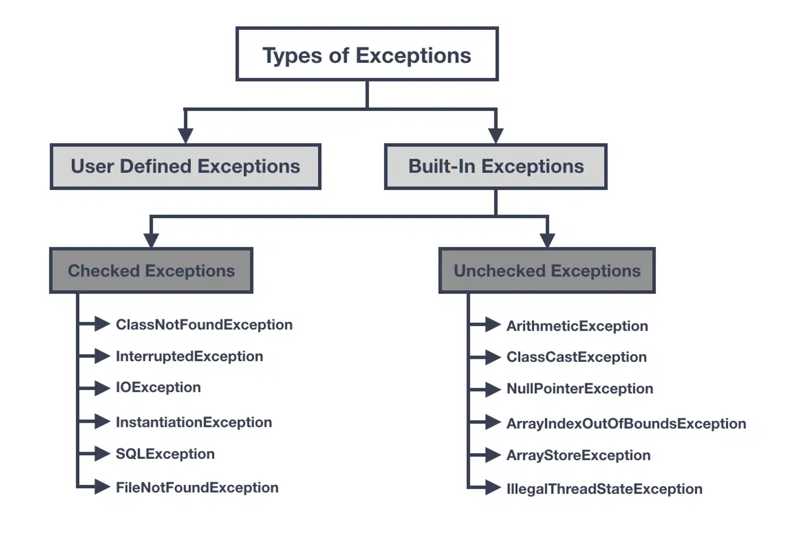

## 예외처리

### 예외는 크게 Checked Exception , Unchecked Exception



[출처][https://rollbar.com/blog/how-to-handle-checked-unchecked-exceptions-in-java/](https://rollbar.com/blog/how-to-handle-checked-unchecked-exceptions-in-java/)

**Checked Exception**은  말그대로 체크해야 하는 예외

- 발생한 예외를 잡아서 체크한 후 해당 예외를 복구 또는 회피를 해서 구체적인 처리를 해야 하는 예외
- 대표적으로 `ClassNotFoundException`

**Unchecked Exception**은 해당 예외에 대한 어떠한 처리를 할 필요가 없는 예외

- 대표적으로 `NullPointerException`, `ArrayIndexOutOfBoundsException` 등
- 흔히 개발자가 코드를 잘못 작성해서 발생하는 이런 오류들은 모두 `RuntimeException`을 상속한 예외들

예외 예제 1. 

- 개발자의 상황에서 생각해보면 암호화폐 지갑은 블록체인과 통신하는 경우가 생기면 A사용자가  B사용자에게 보내려면 잔고를 체크하고 보내야 함.
- 실패하면 다시 처음상태로 되돌아가야 해 : **transaction**
- 개발자가 직접적으로 access할 수 없어서 - 잔액이 부족해요라고 알려줘야 함.

예외 예제 2.

- 할인정책을 정한다고 할 때
- 우리는 예외로 인지를 못하더라도 예외를 던져하는 상황이 있을 수 있음. 0으로 곱한다는 예외를 처리할 때 price*discount면 사용자가 0을 입력했는지 어찌했는지는 난 알 수 없음
- 그렇지만 예외 처리를 해야하므로 discount가 0으로 처리되면 커스텀 예외로 처리를 해야 됨.

### 서비스 계층에서 예외 던지기 (throw)

✔️서비스계층에서 예외가 발생하면 throw로 던질것.

✔️ controller에 예외가 발생하면 @controllerAdvice가 있는 클래스가 받아서 처리할 것임. (⇒ 해당 클래스에서만 처리한다.) → 수정할 때도 해당 클래스만 추가하고 삭제하면 되서 편리함.

그렇게 하려면 전역에서 발생하는 예외를 다 받아서 할 것.

## 사용자 예외 사용

**서비스 계층에서 던친 예외 처리하기**

- 서버쪽에서 발생한 예외를 조금 더 구체적으로 표현할 수 있는 Custom Exception을 만들어 예외를 던질 수 있음
1. **ExceptionCode와 BuisinessLogicException 생성**
   
    
    
    1. **ExceptionCode**
       
        ```java
        package com.springboot.exception;
        
        import lombok.AllArgsConstructor;
        import lombok.Getter;
        
        @AllArgsConstructor
        @Getter
        public enum ExceptionCode {
            MEMBER_NOT_FOUND(404,"Member Not Found"),
            MEMBER_EMAIL_NOT_DUPLICATION(404,"중복된 이메일 주소는 사용할 수 없습니다.");
            private int status;
            private String message;
        
        }
        ```
        
        ExceptionCode를 enum으로 정의하면 비즈니스 로직에서 발생하는 다양한 유형의 예외를 enum에 추가해서 사용 가능
        
    2. **BuisinessLogicException**
       
        ```java
        package com.springboot.exception;
        
        import lombok.Getter;
        
        public class BuisinessLogicExceptiton extends RuntimeException {
            //Runtime중에 exception이 발생했기때문에 Exception이 아닌 RuntimeException을 상속받음
            @Getter
            private ExceptionCode exceptionCode;
            
            public BuisinessLogicExceptiton(ExceptionCode exceptionCode){
                super(exceptionCode.getMessage());
                this.exceptionCode=exceptionCode;
            }
        }
        ```
        
        - `BusinessLogicException`은 `RuntimeException`을 상속하고있음
        - `ExceptionCode`를 멤버 변수로 지정하여 생성자를 통해서 **조금 더 구체적인 예외 정보들을 제공**
        - `RuntimeException`의 생성자(super)로 예외 메시지를 전달
    
    1. **globalExceptionAdvice**
       
        ```java
        @RestControllerAdvice
        public class GlobalExceptionAdvice {
        ...
        
            @ExceptionHandler
            public ResponseEntity handleBusinessLogicException(BuisinessLogicExceptiton e){
                System.out.println("예외캐치!");
                System.out.println(e.getMessage());
        
                int currentStatus = e.getExceptionCode().getStatus();
                return new ResponseEntity(HttpStatus.valueOf(currentStatus));
            }
        }
        
        ```
        
        **`@RestControllerAdvice`**
        
        - *API계층은 아님, RestController에 있는 exception은 내가 다 지켜보고 있다 하는 것.*
        - *즉 controller에서 발생하는 예외를 처리하지만 서비스에서 관리하는 error도 처리.*
        - *서비스 계층에서 발생하는 예외도 controller에서  받기 때문에 가능한 일.*
        
        > @RestControllerAdvice에서 @ResponseStatus를 쓸까? ResponseEntity를 쓸까?
        > 
        
        🔎 한 가지 유형으로 고정된 예외를 처리할 경우 @ResponseStatus로 HttpStatus를 지정해서 사용
        
        🔎 BusinessLogicException처럼 다양한 유형의 Custom Exception을 처리하고자 할 경우에는 ResponseEntity를 사용하기
        
    2. **MemberService**
       
        ```java
        lic class MemberService {
            public Member createMember(Member member) {
                // TODO should business logic
        
                // TODO member 객체는 나중에 DB에 저장 후, 되돌려 받는 것으로 변경 필요.
                // 중복된 주소일 경우 예외 생성
                String duplEmail = "jerry@gmail.com";
               if(member.getEmail().equals(duplEmail)){
                   throw new BuisinessLogicExceptiton(ExceptionCode.MEMBER_EMAIL_NOT_DUPLICATION);
               }
                Member createdMember = member;
                return createdMember;
            }
        
        @Service
        public class MemberService {
            ...
        		...
        
          public Member findMember(long memberId) {
        
                throw new BuisinessLogicExceptiton(ExceptionCode.MEMBER_NOT_FOUND);
        
            }
        }
        ```
        

## 실습

- 실습용 프로젝트 패키지 구성
    - advice
        - 예외 공통 처리를 위한 **GlobalExceptionAdvice**
    - coffee
    - exception
        - BusinessLogicException 클래스
        - ExceptionCode 클래스
    - member
    - order
    - response
        - **ErrorResponse**
    - validator
- 나머지 클래스는 건들지 않고 **GlobalExceptionAdvice와 ErrorResponse만 수정하기**

    

### 헤맸던 부분

1. ErrorResponse클래스에서 생서자랑 메서드 만드는 부분
   
    ```java
    @Getter
    public class ErrorResponse {
        Integer status;
        String message;
        private List<FieldError> fieldErrors;
        private List<ConstraintViolationError> violationErrors;
    
        private ErrorResponse(Integer status,String message,final List<FieldError>fieldErrors,final List<ConstraintViolationError> violationErrors) {
            this.status=status;
            this.message=message;
            this.fieldErrors = fieldErrors;
            this.violationErrors = violationErrors;
    
    //    public static ErrorResponse of(BusinessLogicException businessLogicException) {
    //        return new ErrorResponse(businessLogicException.getExceptionCode().getStatus(),
    //                businessLogicException.getMessage(),
    //                null,
    //                null);
    //    }
    //    public static ErrorResponse of(HttpRequestMethodNotSupportedException httpRequestMethodNotSupportedException) {
    //        return new ErrorResponse(HttpStatus.METHOD_NOT_ALLOWED.value(),HttpStatus.METHOD_NOT_ALLOWED.toString(),
    //                null,
    //                null);
    //    }
    
        public static ErrorResponse of(Integer status, String message, Object o, Object object){
            return new ErrorResponse(status, message,null,null);
        }
    ```
    
    - 4개의 인자를 다 받아야 해서 Object처리하고 null 넣어줌…!
    - 근데 생성자를 하나 더 만들어서 status와 message만 받을 수 있음.
    - 나는 4개를 다 받아서 하느라 헤맸음….
    - 근데 생성자를 2개만 받아도 상관없음
      
        ```java
            public ErrorResponse(Integer status, String message) {
                this.status = status;
                this.message = message;
            }
        ```
        
    
2. globalException
   
    ```java
        @ExceptionHandler
        public ResponseEntity handleHttpRequestMethodNotSupportedException(HttpRequestMethodNotSupportedException e){
            String message="METHOD_NOT_ALLOWED";
            final ErrorResponse response =
                    ErrorResponse.of(HttpStatus.METHOD_NOT_ALLOWED.value(),message,null,null);
            return new ResponseEntity<>(response,HttpStatus.METHOD_NOT_ALLOWED);
        }
        @ExceptionHandler
        public ResponseEntity handleException(Exception e){
    
            final ErrorResponse response = ErrorResponse.of(
                    ExceptionCode.INTERNAL_SERVER_ERROR.getStatus(),
                    ExceptionCode.INTERNAL_SERVER_ERROR.getMessage(),
                    null,
                    null
            );
            return new ResponseEntity<>(response,HttpStatus.INTERNAL_SERVER_ERROR);
        }
    ```
    
    - status와 message를 어떻게 가져올건지
    - 나중에 유지보수가 편하게 만들려면 어떻게 해야하는 건지…몰라서 한참 헤맸음
    - 그래서 그냥 모르겠고 구현이 먼저다 싶어서 일단 작성했음
    
    ---
    
### 해결방법 v1


    
- HttpsStats가 구현된 클래스로 이동해보면 **.value()** 로 상태코드 받아올 수 있고 **.getReasonPhrase()**로 상태메세지 가져올 수 있음.
  
    **GlobalExceptionAdvice**
    
    ```java
    public static ErrorResponse of (HttpRequestMethodNotSupportedException e){
    	HttpStatus currentStatus = HttpStatus.METHOD_NOT_ALLOWED;
    	return new ErrorResponse(currentStatus.value(), currentStatus.getReasonPhrase());
    }
    
    public satic ErrorResponse of(NullPointerException e){
    	HttpStatus currentStatus = HttpStatus.INTERNAL_SERVER_ERROR;
    	return new ErrorResponse(currengtStatus.value(), currentStatus.getReasonPhrase());
    }
    ```
    
    **ErrorResponse**
    
    ```java
    @ExceptionHandler
    public ErrorResponse handleException(NullPointerException e){
    	return ErropResponse.of(e);
    }
    ```
    

### Refactory


**GlobalExceptionAdvice**

```java
@ExceptionHandler
@ResponseStatus(HttpStatus.METHOD_NOT_ALLOWED)
public ErrorResponse handleHttpRequestMethodNotSupportedException(HttpRequestMethodNotSupportedException e){
	return ErrorResponse.of(HttpStatus.Method_NOT_ALLOWED);
}

@ExceptionHandler
@ResponseStatus(HttpStatus.INTERNATIONAL_SERVER_ERROR)
public ErrorResponse handleException(NullpointerException e){
	return ErrorResponse.of(HttpStatus.INTERNAL_SERVER_ERROR);
}
```

관련 예외들을 변수 사용 없이  바로 ErrorResponse로 반환하여 리팩토리 가능.

🔎 참고하기

@Deprecated 앞으로 안쓸거니까 사용을 자제해달라 - 지원하지 않을 예정.


<br/>
<br/>

## Comment

예외처리 어제 것도 이해못했는데 실습하니까 더 이해안가서 더 헤맸음<br/>
돌이켜보면 확실히 코드를 보고 이해하는 것도 중요한데<br/>
백지에서 코드를 쳐보고 헤매는 경험도
중요한 것 같음...!<br/> 그러고 됫을 때 더 이해가 되는 것 같은데
그 과정이 고통스럽다<br/>
강사님이 풀이해주시는 것도 너무 쉽게 풀어서 현타옴...<br/>
나 도대체 뭐한거지..?ㅎ
공식문서나 구현체를 보는게 중요한 것 같아서<br/>
앞으로는 검색해서 블로그보는 것 보단 공식문서를 찾아보는 것이...
좋을것 같다!
<br/>
<br/>
<br/>
<br/>
<br/>
        
<div class="notice" markdown="1">
🍒 `공지` 
<h4> - <u>정보 공유가 아닌 개인이 공부하고 기록하기 복습하기 위한 용도입니다.</u></h4>
</div>
