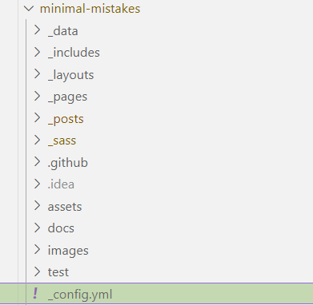
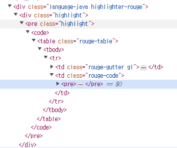
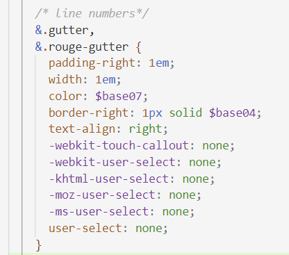
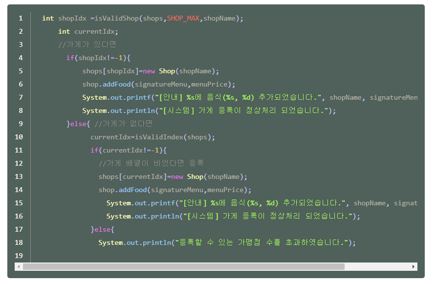

📌 개인적인 공간으로 공부를 기록하고 복습하기 위해 사용하는 블로그입니다. <br>
정확하지 않은 정보가 있을 수 있으니 참고바랍니다 :😸 <br>
[틀린 내용은 댓글로 남겨주시면 복받으실거에요]  
{: .notice--primary}


처음에 블로그 작성할 때 유투브보고 따라하다가<br>
너무 기본적인 것만 있어서<br>
포스트 업로드하면서 마음에 안드는 것 있으면 조금씩 수정하고<br>
공부하는 식빵맘님 블로그 제일 참고 많이 했당..<br>
근데 이걸 기록하지 않으니 다시 수정하고 싶을때 아 어떻게 했더라 기억이 안나서<br>
앞으로는 기록을 남겨보기로 함..<br>


무튼 오늘은 코드블럭을 내맘대로 수정했음<br>
블로그 작성하면서 제일 마음에 안들었던 것이 코드블럭..<br>
처음에 블로그 시작하려 했을 때부터<br>
code block theme 검색하다가 커맨드창에서 설치가능하다는 것 같던데<br>
jekyll 이랑 ruby 설치하다가 애많이 먹어서 그것만 건너뛰었던터라<br>
다시 설치하고 싶지 않았음...!<br>
그래서 셀프로 변경해보기루,,,<br>


### 코드블럭 라인 생성

1. minimal-mistakes 폴더 내에 _config.yml 이 있음<br>
   

2. 쭉 스크롤 내리거나 *Markdown Processing* 검색해보면 

   ```java
   kramdown:
     input: GFM
     hard_wrap: false
     auto_ids: true
     footnote_nr: 1
     entity_output: as_char
     toc_levels: 1..6
     smart_quotes: lsquo,rsquo,ldquo,rdquo
     enable_coderay: false
     syntax_highlighter: rouge
   ```

   여기 이런게 있음. 

   

   여기서  syntax_highlighter: rouge  밑에 아래코드를 추가해주면 line 생성됨

   ```java
     syntax_highlighter_opts:
       block:
         line_numbers: true  
   ```


   그럼 완성!


### 코드블럭 배경 변경

rouge가 처음부터 기본이었는지는 모르겠는데<br>
기존에 적용되어있던 코드블럭 테마는 rouge이다.<br>
위에 kramdown에서도 볼 수 있듯이 _config.yml도 syntax_highlighter: rouge 로 적용되어있음..<br>
이걸 다른 테마이름을 찾아서 바꿔봤는데 적용이 안됨<br>


뭐 설치하기는 싫고 제일 마음에 안드는 건, 배경색깔<br>
블로그보면 background 가 화이트인데 코드블록이 검정색이다 보니 너무 똭! 있는 느낌이라서<br>
회색으로 변경하고 싶었음<br>

그래서 개발자도구창 열어서 (F12) 찾아보니<br>



벗어날 수 없는 rouge...<br>

쟤 찾아서 scss파일 뒤져봤는데 syntax.scss에 적용되어있었음<br>

그래서 여기에 background 가  $background-color로 적용되어있어서 여기를 수정함<br>

```java
div.highlighter-rouge,
figure.highlight {
  position: relative;
  margin-bottom: 1em;
  background: rgba(94, 92, 94, 0.648); //$backgroud-color;
  color: $base05;
  font-family: $monospace;
  font-size: $type-size-6;
  line-height: 1.8;
  border-radius: $border-radius;
```


### 코드라인 복사 방지 기능 추가

드래그 조절 잘하면 되긴 하지만 <br>
아예 방지하기 위해서  syntax.scss에서 line numbers가 있음<br>
여기에 아래 코드 추가해주면 코드 라인은 아예 복사가 안됨!<br>

```java
      -webkit-touch-callout: none;
      -webkit-user-select: none;
      -khtml-user-select: none;
      -moz-user-select: none;
      -ms-user-select: none;
      user-select: none;
```




### 코드블럭 내 폰트 컬러 수정

코드블럭 배경을 변경했더니 코드 폰트 컬러가 진짜 너무 휘향찬란함

1. 

​	variable.scss에도 contrast syntax highlighting (base16)이 있길래 여기서 색 맞춰봤는데

​	전혀 다른 색깔이 나와서 읭 뭐지 했는데 드디어 찾았다

​	내 minimal mistake 에서 skin contrast 라서 

​	여기 _sass > minimal-mistakes > skins > constrats.scss 내에 있는 base16 색깔이 적용됨..  

​	그래서 코드 내 글자 색 변경할거면 적용한 skin의 scss파일 찾아서 변경하면 된다