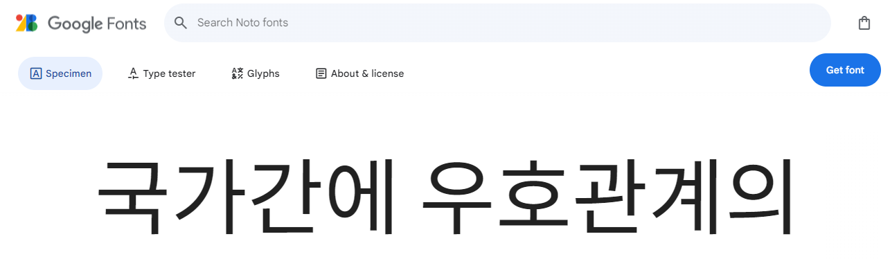

📌 개인적인 공간으로 공부를 기록하고 복습하기 위해 사용하는 블로그입니다. <br>

정확하지 않은 정보가 있을 수 있으니 참고바랍니다 :😸 <br>

[틀린 내용은 댓글로 남겨주시면 복받으실거에요]  

{: .notice--primary}


무료폰트 검색 후 font 적용하면 됨 

보통 web에서 font 사용할 때 cafe24나 googlefont 그리고 눈누 많이 사용

### google font

1. 링크 이동 : https://fonts.google.com

2. 원하는 폰트 선택

3. get font 클릭

   

4. <> Get embed code 클릭  Web → @import  → @import url (~) 복사

   ```CSS
   
   @import url('https://fonts.googleapis.com/css2?family=Noto+Sans+KR:wght@100..900&display=swap');
   
   ```

   

### 눈누

1. 링크이동 : https://noonnu.cc/

2. 원하는 폰트 선택

3. 오른쪽 웹폰트를 사용의 url 복사

   ```css
   @font-face {
       font-family: '양진체';
       src: url('https://fastly.jsdelivr.net/gh/supernovice-lab/font@0.9/yangjin.woff') format('woff');
       font-weight: normal;
       font-style: normal;
   }
   ```

   

### 적용 방법 


1. _ sass폴더 내 minimal-mistakes.css 로 이동

   1. 맨 아래에 url 등록

      ```css
      /* google fonts */
      @import url('https://fonts.googleapis.com/css2?family=Jua&display=swap');
      ```

2. Variable.css

   1. font-family를  sans-serif에서  BlinkMacSystemFont 다음에 입력.

   2. ```css
      /* system typefaces */
      $serif: Georgia, Times, serif !default;
      $sans-serif: -apple-system, BlinkMacSystemFont, "omyu pretty", "Freesentation", "Jua", "Roboto", "Segoe UI",
        "Helvetica Neue", "Lucida Grande", Arial, sans-serif !default;
      $monospace: Monaco, Consolas, "Lucida Console", monospace !default;
      ```


## 로컬 폰트 적용

### cafe24

1. 링크이동: https://fonts.cafe24.com/

2. 원하는 폰트 선택 - 다운로드

3. minimal-mistakes 폴더 내  assets폴더에 fonts라고 폴더 생성 후 다운받은 폰트 담아주기

4. minimal-mistakes.scss 파일 맨 아래에 @font -face 입력

   @font face { 

   ​	} 입력 후 


